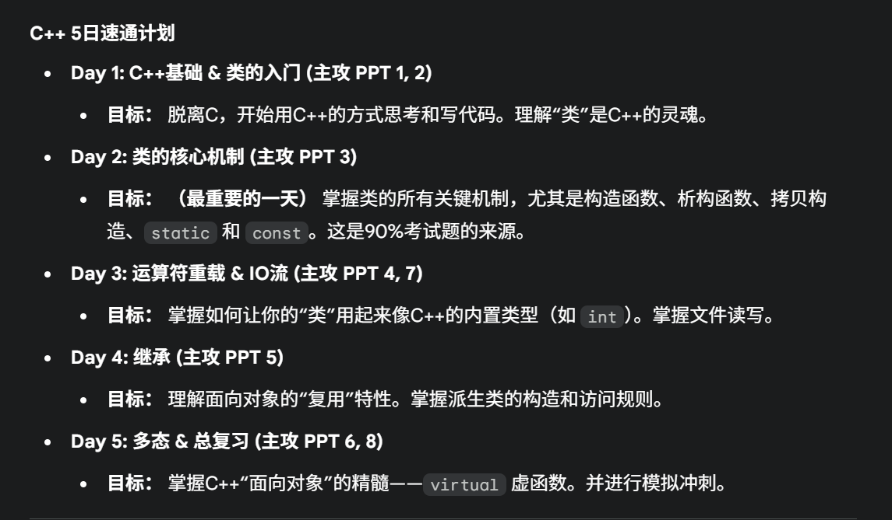

# C++ 5日速通
-----
## Day 1 笔记

> 目标：脱离C，开始用C++的方式思考和写代码。理解“类”是C++的灵魂。主攻 PPT 1, 2, 8。

-----

### 一、从 C 到 C++ (C++新特征)

C++ 是C的超集，你所有的C语言知识（循环、判断、函数、指针）在C++中依然有效。但C++引入了许多新特性，让代码更安全、更简洁。

#### 核心知识点

#### 1\. 输入输出流 (iostream) 与命名空间 (namespace)

  - **输入输出流 (`iostream`)**：

      - C++ 使用 `<iostream>` 头文件进行标准输入输出。
      - 抛弃 `printf()` 和 `scanf()`。
      - `cout`：标准输出流对象（对应屏幕）。
      - `cin`：标准输入流对象（对应键盘）。
      - `<<`：**插入运算符**，用于 `cout`。
      - `>>`：**提取运算符**，用于 `cin`。
      - `endl`：一个**操纵符**，用于换行并**刷新缓冲区**（比 `\n` 功能多）。

  - **命名空间 (`namespace`)**：

      - 为什么需要？为了解决“命名冲突”。比如你写的函数叫 `max`，C++标准库里也有个 `max`，编译器就蒙了。
      - 命名空间就是给你的变量/函数划定一个“领地”。
      - `cin` 和 `cout` 都属于 `std` (standard) 领地。
      - **使用方式**：
        1.  **方式一 (推荐)**：在代码开头使用 `using namespace std;`。
        2.  **方式二 (更规范)**：每次使用时都明确指定领地 `std::cout << "Hello";`。
        3.  **方式三 (折衷)**：只声明你需要的 `using std::cout; using std::cin;`。

    <!-- end list -->

    ```cpp
    #include <iostream> // 1. 包含C++头文件 (没有.h)

    // 2. 使用 std 命名空间 (方式一)
    using namespace std;

    int main() {
        int my_var;
        
        // 3. 使用 cout 和 cin
        cout << "请输入一个整数：" << endl;
        cin >> my_var;
        cout << "你输入的值是: " << my_var << endl;
        
        return 0;
    }
    ```

#### 2\. 引用 (Reference) - (C中没有，重点)

  - **定义**：引用是 C++ 的一个核心补充，你可以把它理解为变量的“别名”。它不是指针，它不存储地址，它就是那个变量本身。
  - **声明**：引用在声明时**必须**初始化，并且一旦绑定，就不能再更改为其他变量的别名。
    ```cpp
    int a = 10;
    int& b = a; // b 是 a 的别名。b 和 a 现在是同一个东西。

    b = 20;      // 等价于 a = 20;
    cout << a;   // 输出 20
    ```
  - **与指针的对比**：
      - 指针需要用 `&` 获取地址，用 `*` 解引用。
      - 引用在声明时使用 `&`，但使用时**就像普通变量一样**，更简洁、更安全（没有空引用，也不能随意指向其他内存）。
  - **最重要用途**：作为函数参数，实现“引用传递”，完美替代 C 语言中的指针参数。
    ```cpp
    // C 语言风格 (传递地址)
    void swap_c(int* a, int* b) {
        int temp = *a;
        *a = *b;
        *b = temp;
    }

    // C++ 风格 (传递引用)
    void swap_cpp(int& a, int& b) {
        int temp = a;
        a = b;
        b = temp;
    }

    int main() {
        int x = 1, y = 2;
        
        // C 调用
        swap_c(&x, &y);   // 必须取地址
        
        // C++ 调用
        swap_cpp(x, y); // 像普通函数一样调用，非常直观
    }
    ```

#### 3\. 动态内存 (new / delete)

  - **C++ 风格**：抛弃 `malloc` 和 `free`。

  - **`new`**：

    1.  **分配内存**。
    2.  `new` 是**运算符**，不是函数。
    3.  它**自动计算**所需字节数 (不需要 `sizeof`)。
    4.  它**自动返回**正确的类型 (不需要类型转换)。

  - **`delete`**：

    1.  **释放内存**。
    2.  如果你 `new` 的是数组 `[]`，释放时必须用 `delete []`。

  - **规则 (必考)**：

      - `new` 对应 `delete`。
      - `new []` 对应 `delete []`。
      - 绝不能混用（`new` 对应 `free`，或 `malloc` 对应 `delete` 都是灾难）。

    <!-- end list -->

    ```cpp
    // C 语言
    int* p_c = (int*) malloc(sizeof(int));
    free(p_c);
    int* p_arr_c = (int*) malloc(10 * sizeof(int));
    free(p_arr_c);

    // C++
    int* p_cpp = new int;
    delete p_cpp;
    int* p_arr_cpp = new int[10];
    delete [] p_arr_cpp;
    ```

#### 4\. const (替代 \#define)

  - **C 风格**：`#define PI 3.14159`
  - **C++ 推荐**：`const double PI = 3.14159;`
  - **优势**：`const` 是一个**变量**，它有明确的**数据类型**，受编译器类型检查的保护，更安全、更易于调试。`#define` 只是预处理器无脑的**文本替换**。

#### 5\. 函数重载 (Overload)

  - **定义**：C++ 允许在**同一作用域**内，有多个**同名**函数。
  - **规则**：只要它们的**参数列表**不同（参数的**个数**、**类型**、**顺序**不同），编译器就能自动根据你传入的实参来匹配对应的函数。
  - **注意**：函数的**返回值不同**，**不能**构成重载。
    ```cpp
    int max(int a, int b) { ... }
    double max(double a, double b) { ... }
    int max(int a, int b, int c) { ... }

    max(10, 20);       // 调用第一个
    max(3.14, 2.71);   // 调用第二个
    max(1, 2, 3);      // 调用第三个
    ```

#### 6\. C++ 效率技巧 (来自 PPT 8)

  - **前置++**：优先使用 `++i` 而不是 `i++`。
  - **原因**：对于 C 语言 `int` 这种内置类型没区别。但对于C++的**类**（比如迭代器），`i++` (后置) 需要创建一个临时对象来保存 `i` 自增前的值，而 `++i` (前置) 直接自增并返回，效率更高。

#### 实例与练习 (Day 1 - 模块一)

#### 练习1：C++ 版 `swap` 函数

  - **题目**：编写一个程序，要求用户输入两个整数，然后调用一个 `swap` 函数交换它们的值，最后输出交换后的结果。
  - **要求**：
    1.  必须使用 `cin` 和 `cout`。
    2.  `swap` 函数必须使用**引用 (`&`)** 来实现，而不是指针。

-----

#### 练习1参考答案

```cpp
#include <iostream>

// 使用命名空间
using namespace std;

// 1. swap 函数使用引用&
// a 和 b 分别是 main 函数中 x 和 y 的别名
void swap_cpp(int& a, int& b) {
    int temp = a;
    a = b;
    b = temp;
}

int main() {
    int x, y;

    // 2. 使用 cout 和 cin
    cout << "请输入两个整数 x 和 y：" << endl;
    cin >> x >> y;

    cout << "交换前: x = " << x << ", y = " << y << endl;

    // 3. C++风格调用，直接传变量名
    swap_cpp(x, y);

    cout << "交换后: x = " << x << ", y = " << y << endl;

    return 0;
}
```

-----

### 二、类的入门 (C++的灵魂)

这是你从 C 到 C++ 最重要的一步。`class` 是 C++ 的灵魂。

#### 核心知识点

#### 1\. 什么是类 (Class)？

  - **定义**：类 (Class) 是 C 语言 `struct` 的超级升级版。
  - **C 的 `struct`**：只能\*\*“打包”数据\*\*（变量）。
  - **C++ 的 `class`**：既能打包**数据**（称为 **数据成员** 或 **属性**），也能打包**函数**（称为 **成员函数** 或 **方法**）。
  - **C++ 的 `struct` vs `class`**：
      - 在 C++ 中，`struct` 几乎等同于 `class`，它也可以有成员函数。
      - **唯一区别 (考点)**：
          - `struct` 默认的访问权限是 `public`。
          - `class` 默认的访问权限是 `private`。

#### 2\. 封装 (Encapsulation) 与访问权限

  - **定义**：封装是面向对象的第一大特性。它将“数据”和“操作数据的函数”打包在一起，并对外部隐藏（`private`）内部的实现细节，只暴露（`public`）安全的接口。
  - **三个关键字**：
      - `public` (公有)：类的**外部**（如 `main` 函数）和**内部**（成员函数）**都可以**访问。这是类的“接口”。
      - `private` (私有)：**只能**被**本类的成员函数**访问。类的外部（如 `main` 函数）**不能**访问。这是“被保护的内部数据”。
      - `protected` (保护)：和 `private` 类似，但允许“子类”访问。（Day 4 讲继承时详谈）。

#### 3\. 类的定义与实例化

  - **定义类 (图纸)**：

    ```cpp
    // 定义一个 "Student" 类
    class Student {

    private: // 私有数据
        std::string name;
        int id;

    public: // 公有函数 (接口)
        // 成员函数可以直接访问私有数据
        void set_info(std::string n, int i) {
            name = n; // OK
            id = i;   // OK
        }

        void display() {
            cout << "Name: " << name << ", ID: " << id << endl;
        }

    }; // 注意：类定义以分号结尾！
    ```

  - **实例化对象 (实物)**：

    ```cpp
    int main() {
        // s1 是 Student 类的一个对象 (也叫“实例”)
        Student s1; 
        Student s2;
    }
    ```

  - **访问成员**：

      - 使用**成员访问运算符 `.` (点运算符)**。

    <!-- end list -->

    ```cpp
    s1.set_info("Tom", 101); // 正确，set_info() 是 public 的
    s1.display();              // 正确，display() 是 public 的

    s1.name = "Jerry"; // **编译错误！** `name` 是 private 的
    cout << s1.id;     // **编译错误！** `id` 是 private 的
    ```

#### 4\. 工程结构：接口与实现分离 (.h / .cpp)

一个好的 C++ 规范是把类的**声明**和**实现**分开。这就像 C 语言的多文件工程。

  - **`student.h` (头文件 - 接口/声明)**：

      - 告诉外界这个类“能做什么”。

    <!-- end list -->

    ```cpp
    #ifndef STUDENT_H
    #define STUDENT_H

    #include <string>

    class Student {
    private:
        std::string name;
        int id;

    public:
        void set_info(std::string n, int i); // 1. 只做函数声明 (原型)
        void display();                      // 2. 只做函数声明 (原型)
    };

    #endif
    ```

  - **`student.cpp` (源文件 - 实现/定义)**：

      - 具体说明这个类“怎么做”。

    <!-- end list -->

    ```cpp
    #include "student.h"  // 1. 必须包含自己的头文件
    #include <iostream>

    using namespace std;

    // 2. 使用 `::` (作用域解析运算符) 来指明这个函数属于 Student 类
    void Student::set_info(string n, int i) {
        name = n; // 3. 在这里写函数的具体实现
        id = i;
    }

    void Student::display() {
        cout << "Name: " << name << ", ID: " << id << endl;
    }
    ```

  - **`::` (作用域解析运算符)**：

      - C++ 中非常重要的运算符。
      - `Student::display()` 的意思是“`Student` 作用域下的那个 `display` 函数”。
      - `std::cout` 的意思是“`std` 命名空间下的那个 `cout` 对象”。

#### 实例与练习 (Day 1 - 模块二)

#### 练习2：定义 `Box` 类

  - **题目**：定义一个 `Box` 类，用来描述一个箱子。
  - **要求**：
    1.  **数据成员 (私有 `private`)**：
          - `double length;`
          - `double width;`
          - `double height;`
    2.  **成员函数 (公有 `public`)**：
          - `void set_data(double l, double w, double h);` // 用来设置长宽高
          - `double get_volume();` // 用来计算并返回体积 (长 \* 宽 \* 高)
          - `void display();` // 用来在屏幕上输出 "Box volume: [体积]"
  - **提示**：
    1.  在 `get_volume()` 函数中，你可以直接访问 `length`, `width`, `height`。
    2.  在 `main` 函数中，创建一个 `Box` 对象 `b1`，调用 `b1.set_data(...)`，然后调用 `b1.display()`。

-----

#### 练习2参考答案

```cpp
#include <iostream>

using namespace std;

// 1. 定义 Box 类
class Box {
// 2. 定义私有数据成员
private:
    double length;
    double width;
    double height;

// 3. 定义公有成员函数
public:
    // 设置数据的函数
    void set_data(double l, double w, double h) {
        length = l;
        width = w;
        height = h;
    }

    // 计算体积的函数
    double get_volume() {
        return length * width * height;
    }

    // 显示体积的函数
    // 内部调用了另一个成员函数 get_volume()
    void display() {
        cout << "Box volume: " << get_volume() << endl;
    }
};

int main() {
    // 4. 创建 Box 对象 b1
    Box b1;

    // 5. 调用公有函数设置数据
    b1.set_data(10.0, 5.0, 2.0);

    // 6. 调用公有函数显示结果
    b1.display(); // 应该输出 "Box volume: 100"
    
    // 也可以单独获取体积
    double vol = b1.get_volume();
    cout << "The volume is " << vol << endl;

    return 0;
}
```

-----
## Day 2 笔记

> 目标：(最重要的一天) 掌握类的所有关键机制，尤其是构造函数、析构函数、拷贝构造、`static` 和 `const`。这是90%考试题的来源。主攻 PPT 3。

-----

### 一、对象的“生” (构造函数)

Day 1 中，我们用 `set_data` 函数来初始化对象。这种方式很繁琐，而且容易忘记调用。C++ 提供了 **构造函数 (Constructor)** 来完美解决这个问题。

#### 核心知识点

#### 1\. 什么是构造函数？

  - **定义**：构造函数是一个特殊的成员函数，它在**创建对象时自动被调用**。
  - **作用**：它的唯一工作就是**初始化对象**，确保对象一“出生”就处于一个合理、有效的状态。

#### 2\. 构造函数的规则

  - 函数名**必须与类名完全相同**。
  - 它**没有返回类型**，连 `void` 都不写。
  - 它可以被**重载 (Overload)**，就像普通函数一样。
  - 你一旦定义了**任何**构造函数，C++ 编译器就**不会**再为你提供默认的（空的）构造函数。

#### 3\. 构造函数的类型 (考点)

  - **默认构造函数**：

      - 定义：不带参数的构造函数。
      - `Box() { length = 1; width = 1; height = 1; }`
      - 调用：`Box b1;` (注意：**不是 `Box b1();`**，`Box b1();` 是声明一个函数)

  - **带参数的构造函数**：

      - 定义：`Box(double l, double w, double h) { length = l; ... }`
      - 调用：`Box b1(10, 5, 2);`

  - **参数初始化列表 (推荐的初始化方式)**：

      - 这是C++推荐的**初始化**方式，它发生在函数体 `{}` 执行**之前**，效率更高。
      - **语法**：写在函数头和函数体之间，以冒号 `:` 开始。
      - **对比**：
        ```cpp
        // 方式一：在函数体内“赋值”(Assignment)
        Box::Box(double l, double w, double h) {
            length = l; // 这是赋值
            width = w;
            height = h;
        }

        // 方式二：使用“初始化列表”(Initialization)
        Box::Box(double l, double w, double h) : length(l), width(w), height(h) {
            // 函数体可以是空的
        } 
        ```
      - **必须使用**初始化列表的情况：
        1.  初始化 `const` (常量) 成员。
        2.  初始化“引用 (`&`)”成员。
        3.  初始化没有默认构造函数的“子对象”。

  - **带默认参数的构造函数**：

      - 它可以将多个构造函数合并为一个，非常灵活。
      - `Box(double l = 1.0, double w = 1.0, double h = 1.0) : length(l), ... {}`
      - **调用**：
          - `Box b1;` (使用所有默认值, l=1, w=1, h=1)
          - `Box b2(5.0);` (l=5, w=1, h=1)
          - `Box b3(5.0, 2.0);` (l=5, w=2, h=1)
      - **二义性 (Ambiguity) 错误**：
          - 如果你同时提供了 `Box()` 和 `Box(double l = 1.0)`，那么 `Box b1;` 这句代码就会产生**二义性**，编译器不知道该调用哪一个，导致编译失败。
          - 规则：一个类只能有一个“默认构造函数”（即可以不带参数调用的构造函数）。

#### 实例与练习 (Day 2 - 模块一)

#### 练习1：升级 `Box` 类

  - **题目**：升级 Day 1 的 `Box` 类。
  - **要求**：
    1.  删除 `set_data` 函数。
    2.  添加一个**带默认参数的构造函数**，`length`, `width`, `height` 默认值均为 `1.0`。
    3.  使用**参数初始化列表**的方式来完成初始化。
  - **提示**：`Box(double l = 1.0, double w = 1.0, double h = 1.0);`

-----

#### 练习1参考答案

```cpp
#include <iostream>
using namespace std;

class Box {
private:
    double length;
    double width;
    double height;

public:
    // 1. 带默认参数的构造函数，使用初始化列表
    Box(double l = 1.0, double w = 1.0, double h = 1.0) : length(l), width(w), height(h) {
        // 构造函数体，可以为空
        cout << "Box created with l=" << l << ", w=" << w << ", h=" << h << endl;
    }

    double get_volume() {
        return length * width * height;
    }

    void display() {
        cout << "Box volume: " << get_volume() << endl;
    }
};

int main() {
    Box b1;          // 调用 Box(1.0, 1.0, 1.0)
    Box b2(10.0);    // 调用 Box(10.0, 1.0, 1.0)
    Box b3(10.0, 5.0, 2.0); // 调用 Box(10.0, 5.0, 2.0)

    b1.display(); // 输出 1
    b2.display(); // 输出 10
    b3.display(); // 输出 100

    return 0;
}
```

-----

### 二、对象的“死” (析构函数)

有“生”就有“死”。对象在被销毁时，会自动调用**析构函数 (Destructor)**，允许我们在对象“死亡”前执行清理工作。

#### 核心知识点

#### 1\. 什么是析构函数？

  - **定义**：析构函数是构造函数的反面，它在**对象生命周期结束时**（例如 `main` 函数结束，或 `delete` 被调用时）自动被调用。
  - **作用**：**清理 (Cleanup)**。最常见的用途是释放你在构造函数中用 `new` 申请的内存。如果你不释放，就会**内存泄漏 (Memory Leak)**。

#### 2\. 析构函数的规则

  - 函数名是 `~` (波浪号) 加上类名（例如 `~Box`）。
  - **没有返回值**（连 `void` 都不写），也**没有任何参数**。
  - 一个类**有且仅有一个**析构函数。

#### 3\. 调用时机 (考点)

  - **先进后出 (LIFO)**：析构函数的**调用顺序**与构造函数的**调用顺序**正好**相反**。
  - 就像 C 语言中函数调用的栈，后创建的对象（在栈顶）先被销毁。
    ```cpp
    int main() {
        cout << "--- main start ---" << endl;
        Box b1(1); // 1. b1 构造
        Box b2(2); // 2. b2 构造
        cout << "--- main end ---" << endl;
        
        // main 结束
    } // 3. b2 析构 (后构造, 先析构)
      // 4. b1 析构 (先构造, 后析构)
    ```

#### 实例与练习 (Day 2 - 模块二)

#### 练习2：观察 `Box` 类的生命周期

  - **题目**：在 `Box` 类中添加析构函数，并观察构造和析构消息的打印顺序。
  - **要求**：
    1.  在你的 `Box` 构造函数中，打印 "Box created."。
    2.  为 `Box` 类添加一个析构函数 `~Box()`，在函数体中打印 "Box destroyed."。
    3.  在 `main` 函数中按顺序创建 `b1`, `b2`, `b3`，运行程序，观察控制台的输出。

-----

#### 练习2参考答案

```cpp
#include <iostream>
using namespace std;

class Box {
private:
    double volume;
    int id;
public:
    Box(int i) : volume(1.0), id(i) {
        cout << "Box " << id << " created." << endl;
    }
    
    // 析构函数
    ~Box() {
        cout << "Box " << id << " destroyed." << endl;
    }
};

int main() {
    cout << "--- Entering main ---" << endl;
    
    Box b1(1); // 1. 构造 b1
    Box b2(2); // 2. 构造 b2
    Box b3(3); // 3. 构造 b3
    
    cout << "--- Exiting main ---" << endl;
    
    return 0;
} // 4. 析构 b3 (后进先出)
  // 5. 析构 b2
  // 6. 析构 b1
```

**预期输出：**

```
--- Entering main ---
Box 1 created.
Box 2 created.
Box 3 created.
--- Exiting main ---
Box 3 destroyed.
Box 2 destroyed.
Box 1 destroyed.
```

-----

### 三、对象的“复制” (拷贝构造函数)

当你用一个已有的对象去创建另一个新对象时，C++ 不会调用普通的构造函数，而是会调用**拷贝构造函数 (Copy Constructor)**。

#### 核心知识点

#### 1\. 什么是拷贝构造函数？

  - **定义**：它也是一种构造函数，它的功能是“用一个老对象来初始化一个新对象”。
  - **默认行为**：如果你不自己写，C++会帮你自动生成一个。这个默认的拷贝构造函数会执行“**浅拷贝** (Shallow Copy)”——即逐个字节复制所有成员。
  - **浅拷贝的问题**：如果你的类中有指针（`int* data`），浅拷贝只会复制指针的**地址**，而不是指针指向的**内存**。这会导致两个对象指向**同一块**内存，当其中一个对象析构并 `delete` 这块内存后，另一个对象就变成了“悬垂指针”，程序会崩溃。
  - **深拷贝 (Deep Copy)**：因此，凡是类中**有动态内存 (`new`)** 的，**必须**手动编写拷贝构造函数来实现“深拷贝”，即为新对象重新 `new` 一块内存。

#### 2\. 拷贝构造函数的格式 (必背！)

  - **`ClassName(const ClassName& obj)`**
  - 例如 `Box(const Box& other)`。
  - **`const`**：因为你只是“复制”，不应该改变原来的对象 `other`。
  - **`&` (引用)**：**(经典考点)** **必须**是引用。
      - **原因**：如果不用引用 `Box(Box other)`，参数传递会是“传值”。C++ 中“传值”是通过**调用拷贝构造函数**来创建副本的。
      - **结果**：`调用拷贝构造 -> 需要传值 -> 调用拷贝构造 -> 需要传值 ...` 导致**无限递归**，栈溢出。

#### 3\. 调用时机 (必考！)

  - **情况1：显式初始化 (Initialization)**
    ```cpp
    Box b1(10, 5, 2);
    Box b2(b1);     // 显式调用拷贝构造
    Box b3 = b1;    // 隐式调用拷贝构造 (注意：这是初始化，不是赋值)
    ```
  - **情况2：当函数参数是对象（传值）**
    ```cpp
    // void print_box(Box b) 会在调用时创建 b，这个 b 是 b1 的副本
    void print_box(Box b) { b.display(); }

    int main() {
        Box b1;
        print_box(b1); // 调用拷贝构造函数
    }

    // 优化：使用 const 引用，可以避免不必要的拷贝
    // void print_box(const Box& b) { ... }
    ```
  - **情况3：当函数返回值是对象**
    ```cpp
    Box create_box() {
        Box b_temp(5, 5, 5);
        return b_temp; // 返回时，会调用拷贝构造函数创建一个临时的返回值
    }
    ```

#### 4\. 赋值 (`=`) vs 拷贝构造 (`=`)

  - **拷贝构造 (初始化)**：`Box b2 = b1;` (在 `b2` **诞生**时调用)
  - **赋值 (Assignment)**：`b2 = b1;` (在 `b2` **已经存在**后调用)
      - 赋值调用的是**赋值运算符 (operator=)**，Day 3 我们会讲。

#### 实例与练习 (Day 2 - 模块三)

#### 练习3：拷贝构造函数探秘

  - **题目**：为 `Box` 类添加一个拷贝构造函数，并观察它何时被调用。
  - **要求**：
    1.  在 `Box` 类中添加 `Box(const Box& other)`。
    2.  在函数体中打印 `Copy Constructor called!`
    3.  编写一个 `void test_copy(Box b)` 函数（参数是传值）。
    4.  在 `main` 中测试 `Box b2 = b1;` 和 `test_copy(b1);` 两种情况。

-----

#### 练习3参考答案

```cpp
#include <iostream>
using namespace std;

class Box {
private:
    double l, w, h;
public:
    // 默认构造函数
    Box(double l=1, double w=1, double h=1) : l(l), w(w), h(h) {
        cout << "  Constructor called." << endl;
    }
    
    // 1. 拷贝构造函数
    Box(const Box& other) : l(other.l), w(other.w), h(other.h) {
        cout << "  COPY Constructor called!" << endl;
    }
    
    // 析构函数
    ~Box() {
        cout << "  Destructor called." << endl;
    }
};

// 2. test_copy 函数，参数b是传值
void test_copy(Box b) {
    cout << "  Inside test_copy function." << endl;
} // <--- b 在这里被析构

int main() {
    cout << "Creating b1..." << endl;
    Box b1(10, 5, 2); // 调用普通构造
    
    cout << "\nCreating b2 = b1..." << endl;
    Box b2 = b1; // 3. 调用拷贝构造
    
    cout << "\nCalling test_copy(b1)..." << endl;
    test_copy(b1); // 4. 调用拷贝构造
    
    cout << "\nExiting main..." << endl;
    return 0;
} // <--- b2 和 b1 在这里被析构
```

**预期输出：**

```
Creating b1...
  Constructor called.

Creating b2 = b1...
  COPY Constructor called!

Calling test_copy(b1)...
  COPY Constructor called!
  Inside test_copy function.
  Destructor called.

Exiting main...
  Destructor called.
  Destructor called.
```

-----

### 四、共享与保护 (static 与 const)

这是两个 C++ 中非常重要的关键字，用于修饰类的成员，是面向对象设计的基础。

#### 核心知识点

#### 1\. `static` (静态/共享)

  - **`static` 数据成员**：

      - **定义**：被 `static` 修饰的数据成员**不属于任何一个对象，而是被所有对象共享**。它属于这个**类**本身。
      - **内存**：`static` 成员存储在**全局/静态存储区**，**只存在一份**。
      - **考点：** 静态数据成员**必须在类外（.cpp文件）初始化**。
        ```cpp
        // Student.h
        class Student {
            static int total_students; // 1. 声明
        };

        // Student.cpp
        int Student::total_students = 0; // 2. 定义和初始化
        ```

  - **`static` 成员函数**：

      - **定义**：被 `static` 修饰的成员函数也属于类，不属于对象。
      - **考点：** 静态函数**没有 `this` 指针**。
      - **考点：** (因为没有 `this` 指针) 它**只能访问 `static` 成员**（静态数据/静态函数），**不能**访问非静态成员（比如 `name`, `id`），因为它不知道你想访问 *哪个* 对象的 `name`。
      - **调用方式**：
          - `Student::show_total();` (推荐，用类名调用)
          - `s1.show_total();` (也可以用对象名调用，但不推荐)

#### 2\. `const` (常量/保护)

  - **`const` 数据成员 (常数据成员)**：

      - `const int MAX_SCORE;`
      - **考点：** 它**必须**在**构造函数的初始化列表**中被初始化。

  - **`const` 成员函数 (常成员函数) (重点)**：

      - **格式**：`void display() const;` ( `const` 写在函数头**末尾**)。
      - **作用**：这个函数向编译器**保证**：“我是一个‘只读’函数，我**绝不会修改**类中的任何数据成员”。
      - **`const` 对象的“紧箍咒”**：
          - `const` 成员函数 **不能** 调用 **非 `const`** 成员函数。
          - `const` 成员函数 **不能** 修改**非 `static`** 数据成员。

  - **`const` 对象 (常对象)**：

      - **定义**：`const Student s1("Tom", 101);`
      - **考点：** 常对象**只能调用它的常成员函数 (`const` 函数)**。它不能调用任何非 `const` 函数，因为非 `const` 函数有“修改数据”的嫌疑。

#### 实例与练习 (Day 2 - 模块四)

#### 练习4：`static` 与 `const` 综合应用

  - **题目**：创建一个 `Student` 类，统计学生总数，并保护 `id` 不被修改。
  - **要求**：
    1.  `private` 成员：
          - `string name;`
          - `const int id;` (常数据成员)
          - `static int total_students;` (静态数据成员)
    2.  `public` 成员：
          - 构造函数 `Student(string n, int i);`
              - 使用**初始化列表**初始化 `name` 和 `id`。
              - 在函数体中，将 `total_students` 加 1。
          - 析构函数 `~Student();`
              - 在函数体中，将 `total_students` 减 1。
          - **常成员函数** `void display() const;`
              - 打印 "Name: [name], ID: [id]"。
          - **静态成员函数** `static void show_total();`
              - 打印 "Total students: [total\_students]"。
    3.  在类外初始化 `total_students`。
    4.  在 `main` 函数中测试所有功能。

-----

#### 练习4参考答案

```cpp
#include <iostream>
#include <string>
using namespace std;

class Student {
private:
    string name;
    const int id; // 1. 常数据成员
    static int total_students; // 2. 静态数据成员 (声明)

public:
    // 3. 构造函数
    Student(string n, int i) : name(n), id(i) { // 4. id 必须在初始化列表
        total_students++;
        cout << "Student " << name << " created." << endl;
    }

    // 5. 析构函数
    ~Student() {
        total_students--;
        cout << "Student " << name << " destroyed." << endl;
    }

    // 6. 常成员函数
    void display() const {
        // name = "test"; // 错误！const 函数不能修改成员
        cout << "Name: " << name << ", ID: " << id << endl;
    }

    // 7. 静态成员函数
    static void show_total() {
        // cout << name; // 错误！静态函数不能访问非静态成员
        cout << "--- Total students: " << total_students << " ---" << endl;
    }
};

// 8. 静态数据成员在类外初始化
int Student::total_students = 0;

int main() {
    Student::show_total(); // 9. 通过类名调用静态函数

    { // 创建一个代码块来观察生命周期
        Student s1("Alice", 101);
        Student s2("Bob", 102);

        Student::show_total();
        s1.display();
        s2.display();
    } // s1 和 s2 在这里被析构

    Student::show_total();
    
    // 10. 常对象
    const Student s_const("Const_Student", 007);
    s_const.display(); // OK, display() 是 const 函数
    // s_const.name = "test"; // 错误！s_const 是常对象

    return 0;
}
```

-----

### 五、类的“朋友” (friend)

封装是 C++ 的核心，但有时过于严格。`friend` (友元) 机制允许我们**有选择地**“**破坏封装**”，让特定的外部函数或类访问本类的 `private` 成员。

#### 核心知识点

#### 1\. 友元函数

  - **定义**：在类内部使用 `friend` 关键字声明的**外部函数**。
  - **特点**：它**不是**成员函数，但它**可以**访问该类的 `private` 和 `protected` 成员。
    ```cpp
    class Box {
    private:
        double width;
    public:
        // 1. 声明一个友元函数
        friend void print_width(const Box& b);
    };

    // 2. 在类外定义这个普通函数 (注意：没有 Box::)
    void print_width(const Box& b) {
        // 3. 可以直接访问 b 的私有成员
        cout << "Box width: " << b.width << endl;
    }
    ```

#### 2\. 友元类

  - **定义**：在 `A` 类中声明 `B` 类为友元。

  - **特点**：`B` 类的**所有**成员函数都可以访问 `A` 类的 `private` 和 `protected` 成员。

    ```cpp
    class Box {
        double width;
        // ...
        
        // 声明 Manager 类是 Box 的朋友
        friend class Manager;
    };

    class Manager {
    public:
        void change_box_width(Box& b, double new_w) {
            b.width = new_w; // OK! Manager 是 Box 的朋友
        }
    };
    ```

  - **友元规则 (考点)**：

    1.  **单向性**：A 是 B 的朋友，不代表 B 是 A 的朋友。
    2.  **非传递性**：A 是 B 的朋友，B 是 C 的朋友，不代表 A 是 C 的朋友。
    3.  **非继承性**：A 是 B 的朋友，B 的子类**不是** A 的朋友。

#### 实例与练习 (Day 2 - 模块五)

#### 练习5：友元函数

  - **题目**：有一个 `Wallet` (钱包) 类，`money` 是私有的。编写一个外部的 `steal_money` 函数，作为 `Wallet` 的友元，来修改 `money`。
  - **要求**：
    1.  `Wallet` 类有 `private: int money;`
    2.  `Wallet` 有一个构造函数 `Wallet(int m)`。
    3.  `Wallet` 有一个 `display()` 函数打印 `money`。
    4.  `Wallet` 声明 `friend void steal_money(Wallet& w, int amount);`
    5.  在 `main` 函数中测试，先创建钱包，再 `steal_money`，再 `display`。

-----

#### 练习5参考答案

```cpp
#include <iostream>
using namespace std;

// 必须提前声明 Wallet 类，因为 steal_money 用到了它
class Wallet; 

// 1. 外部函数定义
void steal_money(Wallet& w, int amount);

class Wallet {
private:
    int money;
public:
    Wallet(int m) : money(m) {}
    
    void display() const {
        cout << "Wallet has: " << money << " dollars." << endl;
    }
    
    // 2. 声明友元
    friend void steal_money(Wallet& w, int amount);
};

// 3. 友元函数的实现
// 注意：没有 Wallet::，因为它不是成员函数
void steal_money(Wallet& w, int amount) {
    w.money -= amount; // 4. 可以访问私有成员
    cout << "Stole " << amount << " dollars!" << endl;
}

int main() {
    Wallet my_wallet(1000);
    my_wallet.display();
    
    steal_money(my_wallet, 200);
    
    my_wallet.display(); // 剩下 800
    return 0;
}
```
-----
## Day 3 笔记

> 目标：掌握如何让你的“类”用起来像C++的内置类型（如 `int`）。掌握文件读写。主攻 PPT 4, 7。

-----

### 一、运算符重载 (Operator Overloading)

在C语言中，你可以写 `int a = 5, b = 10, c = a + b;`。
但在 Day 2，如果你有两个 `Complex` (复数) 对象 `c1`, `c2`，你只能写一个成员函数，像 `Complex c3 = c1.complex_add(c2);`。这不够直观。

C++的运算符重载允许我们“重定义”运算符的行为，让我们能写出 `Complex c3 = c1 + c2;` 这样更自然的代码。

#### 核心知识点

#### 1\. 运算符重载的语法

  - **定义**：运算符重载的本质是**函数重载**。它是一个特殊的函数，函数名由 `operator` 关键字和你要重载的运算符符号组成。
  - **语法**：`函数类型 operator运算符(形参表)`
    ```cpp
    // 比如重载加法 +
    Complex operator+(...);

    // 比如重载流插入 <<
    ostream& operator<<(...);
    ```

#### 2\. 两种实现方式 (重点：成员 vs 友元)

重载一个二元运算符（如 `+`, `-`）有两种方式：

  - **A. 重载为成员函数 (Member Function)**

      - **规则**：左侧的操作数**必须**是该类的对象，它会成为调用者（`this`）。右侧的操作数作为**参数**传入。
      - **原型 (在类中)**：`Complex operator+(Complex& c2);`
      - **调用**：`c1 + c2`
      - **编译器解释**：`c1.operator+(c2)`
      - **局限 (考点)**：因为左侧操作数必须是类的对象，所以 `c1 + 2` (需要写一个 `c1.operator+(int)`) 可以实现，但 `2 + c1` **无法实现**。

  - **B. 重载为友元函数 (Friend Function)**

      - **规则**：没有 `this` 指针。**两个**操作数都作为**参数**传入。
      - **原型 (在类中)**：`friend Complex operator+(Complex& c1, Complex& c2);`
      - **调用**：`c1 + c2`
      - **编译器解释**：`operator+(c1, c2)`
      - **优势 (考点)**：由于它不是成员函数，左侧操作数可以是任意类型。这完美解决了 `2 + c1` 的问题。我们可以专门写一个 `friend Complex operator+(int i, Complex& c);` 来处理这种情况。

#### 3\. 运算符重载的规则 (考点)

  - **(1) 不能创造新运算符**：你不能重载 `#` 或者 `$` 这种 C++ 没有的运算符。

  - **(2) 不能改变优先级和结合性**：你重载了 `+` 和 `*`，`*` 的优先级仍然高于 `+`。

  - **(3) 不能改变操作数个数**：`+` 永远是二元运算符，`++` 永远是单元运算符。

  - **(4) 不能重载的运算符 (必记)**：

      - `.` (成员访问)
      - `.*` (成员指针访问)
      - `::` (作用域解析)
      - `?:` (三目运算符)
      - `sizeof`

  - **(5) 必须重载为成员函数的运算符 (必记)**：

      - `=` (赋值)
      - `[]` (数组下标)
      - `()` (函数调用)
      - `->` (指针访问)

#### 实例与练习 (Day 3 - 模块一)

#### 练习1：`Complex` 类加法重载

  - **题目**：定义一个 `Complex` (复数) 类，实现 `Complex + Complex` 和 `Complex + int` 两种加法。
  - **要求**：
    1.  `Complex` 有 `private` 成员 `double real` 和 `double imag`。
    2.  `Complex(double r, double i)` 构造函数。
    3.  `display()` 函数用于打印。
    4.  `Complex + Complex` (如 `c1 + c2`) 使用**成员函数**实现。
    5.  `Complex + int` (如 `c1 + 10`) 使用**友元函数**实现 (以演示该方法)。

-----

#### 练习1参考答案

```cpp
#include <iostream>
using namespace std;

class Complex {
private:
    double real;
    double imag;

public:
    // 构造函数
    Complex(double r = 0.0, double i = 0.0) : real(r), imag(i) {}

    // 1. operator+ 作为成员函数 (用于 Complex + Complex)
    // 编译器解释为 c1.operator+(c2)
    Complex operator+(Complex& other) {
        cout << "  (成员函数 operator+ 被调用)" << endl;
        double r = this->real + other.real;
        double i = this->imag + other.imag;
        return Complex(r, i);
    }
    
    // 2. operator+ 作为友元函数 (用于 Complex + int)
    // 友元声明
    friend Complex operator+(const Complex& c, int i);

    // 打印函数
    void display() const {
        cout << "(" << real << ", " << imag << "i)" << endl;
    }
};

// 3. 友元函数的定义 (在类外)
Complex operator+(const Complex& c, int i) {
    cout << "  (友元函数 operator+ 被调用)" << endl;
    // 可以访问 private 成员
    double r = c.real + i;
    return Complex(r, c.imag);
}

int main() {
    Complex c1(1.0, 2.0);
    Complex c2(3.0, 4.0);
    Complex c3;

    cout << "c1 + c2:" << endl;
    c3 = c1 + c2; // 调用成员函数 c1.operator+(c2)
    c3.display();

    cout << "\nc1 + 10:" << endl;
    c3 = c1 + 10; // 调用友元函数 operator+(c1, 10)
    c3.display();
    
    // c3 = 10 + c1; // 这行会报错，因为我们没有定义 operator+(int, Complex)

    return 0;
}
```

-----

### 二、流插入(`<<`)与流提取(`>>`)重载

这是运算符重载中最特殊、也最常考的一种。我们希望 `cout << c1;` 就能打印出复数。

#### 核心知识点

#### 1\. 为什么必须是友元 (或非成员函数)？

  - 思考 `cout << c1;` 这句代码。
  - 运算符 `<<` 的左侧操作数是 `cout` (一个 `ostream` 类的对象)，右侧是 `c1` (我们的 `Complex` 对象)。
  - 如果我们把它写成**成员函数**，编译器会试图将其解释为 `c1.operator<<(cout)`。这显然是错的，`c1` 在左边了。
  - 正确的解释应该是 `operator<<(cout, c1)`。
  - 因此，`<<` 和 `>>` 的重载**必须**是**非成员函数**。
  - 为了能访问 `Complex` 的 `private` 成员 `real` 和 `imag`，我们将其声明为**友元 (friend)**。

#### 2\. 签名 (必背)

  - **`<<` (输出) 签名**：
    `ostream& operator<<(ostream& output, const MyClass& obj)`

  - **`>>` (输入) 签名**：
    `istream& operator>>(istream& input, MyClass& obj)`

#### 3\. 链式调用 (Chainable)

  - 为什么函数要返回 `ostream&` (输出流的引用)？
  - 是为了实现**链式调用**。
  - 当你写 `cout << c1 << endl;` 时：
    1.  `operator<<(cout, c1)` 被调用。
    2.  它执行完后，**返回 `cout` 对象本身**。
    3.  表达式变为 `cout << endl;`，得以继续执行。

#### 实例与练习 (Day 3 - 模块二)

#### 练习2：为 `Complex` 类重载 `<<`

  - **题目**：基于练习1的 `Complex` 类，为其添加 `<<` 流插入运算符重载。
  - **要求**：
    1.  在类中声明 `friend ostream& operator<<(...)`。
    2.  在类外实现该函数。
    3.  `main` 函数中用 `cout << c1;` 来代替 `c1.display();`。

-----

#### 练习2参考答案

```cpp
#include <iostream>
using namespace std;

class Complex {
private:
    double real;
    double imag;

public:
    Complex(double r = 0.0, double i = 0.0) : real(r), imag(i) {}

    // ... (operator+ 等函数) ...
    
    // 1. 声明友元
    friend ostream& operator<<(ostream& output, const Complex& c);
};

// 2. 实现友元函数 (注意：没有 Complex::)
//    返回 ostream& 以便链式调用
ostream& operator<<(ostream& output, const Complex& c) {
    // 3. 访问私有成员并组织输出格式
    output << "(" << c.real << ", " << c.imag << "i)";
    // 4. 返回流对象
    return output;
}


int main() {
    Complex c1(1.0, 2.0);
    Complex c2(3.0, 4.0);

    // 5. 直接使用 << 运算符
    cout << "c1 is: " << c1 << endl;
    cout << "c2 is: " << c2 << endl;

    return 0;
}
```

-----

### 三、文件输入输出 (I/O Streams)

C++ 提供了 `fstream` 库来替代C语言的 `FILE*` 和 `fprintf/fread`。C++ 的文件流是**类型安全**、**可扩展**（支持 `<<` 重载）的。

#### 核心知识点

#### 1\. C++的I/O流概念

  - `<iostream>`：用于**控制台** I/O（`cin`, `cout`）。
  - `<fstream>`：用于**文件** I/O。
  - `<fstream>` 库提供了三个核心类：
    1.  `ifstream`：Input File Stream (只读文件)。
    2.  `ofstream`：Output File Stream (只写文件)。
    3.  `fstream`：File Stream (可读可写)。

#### 2\. 文件I/O三(四)部曲 (文本文件)

  - **1. 打开文件**：
      - 在定义对象时直接打开：
        `ofstream outfile("f1.txt");`
        `ifstream infile("f1.txt");`
  - **2. 检查打开是否成功 (必须！)**：
      - `if (!outfile)` 或 `if (!infile)`
      - `if (outfile.is_open())`
    <!-- end list -->
    ```cpp
    if (!outfile) {
        cerr << "File open error!" << endl;
        exit(1); // 退出程序
    }
    ```
  - **3. 读/写文件**：
      - 就像使用 `cout` 和 `cin` 一样，使用 `<<` 和 `>>`。
      - `outfile << "Hello " << 123 << endl;`
      - `infile >> my_string >> my_int;`
  - **4. 关闭文件**：
      - `outfile.close();`
      - `infile.close();`

#### 3\. 文件打开模式 (File Modes)

  - 在打开文件时，可以指定第二个参数（文件模式）。
  - `ofstream outfile("log.txt", ios::app);`
  - 常用模式：
      - `ios::in`：(Input) 读模式（`ifstream` 默认）。
      - `ios::out`：(Output) 写模式（`ofstream` 默认）。**会清空**文件原有内容。
      - `ios::app`：(Append) **追加**模式。在文件末尾写入，**不清空**原有内容。
      - `ios::binary`：**二进制**模式（见下文）。
  - 可以使用 `|` (按位或) 组合模式：`ios::out | ios::binary`。

#### 4\. 二进制文件 (Binary I/O)

  - **为什么需要？** 文本I/O ( `<<` ) 会进行格式转换（例如 `int 100` 存为 `"100"` 三个字符）。二进制I/O不转换，直接将**内存中的字节**原封不动地“拷贝”到文件。它更快，且能精确保存 `struct` 或 `class` 对象。
  - **模式**：打开时必须指定 `ios::binary`。
      - `ofstream outfile("stud.dat", ios::binary);`
  - **`write()` (写)**：
      - `outfile.write((char*)&obj, sizeof(obj));`
  - **`read()` (读)**：
      - `infile.read((char*)&obj, sizeof(obj));`
  - **(考点)** 为什么要 `(char*)` 强制转换？
      - 因为 `read/write` 函数被设计为接收通用的**字节指针**，在C++中 `char*` 就代表字节指针。`&obj` 是一个 `Student*` 指针，你需要告诉编译器“别管它是什么类型，就把它当成一堆字节来处理”。

#### 5\. 格式化输出 (了解)

  - 需要包含 `<iomanip>` 头文件。
  - **`setw(n)`**：设置**下一个**输出的字段宽度。
  - **`setfill(c)`**：设置填充字符（默认为空格）。
  - **`setprecision(n)`**：设置浮点数的精度（小数位数）。
  - **`setiosflags(ios::left)`**：左对齐（默认为右对齐）。
  - **`setiosflags(ios::fixed)`**：固定小数位数（而不是科学计数法）。
    ```cpp
    double pi = 3.14159;
    // 输出 |***3.14| (总宽度10, 填充*, 精度2)
    cout << setw(10) << setfill('*') << setiosflags(ios::fixed) << setprecision(2) << pi << endl;
    ```

#### 实例与练习 (Day 3 - 模块三)

#### 练习3：文本文件读写

  - **题目**：模拟 PPT 7 (Page 29-30) 的例子。
  - **要求**：
    1.  创建一个 `f1.txt`。
    2.  使用 `ofstream` 和 `<<` 向文件写入 10 个整数 (1 2 3 ... 10)。
    3.  关闭文件。
    4.  使用 `ifstream` 和 `>>` 从 `f1.txt` 中读回这 10 个整数，并打印到屏幕上。

-----

#### 练习3参考答案

```cpp
#include <iostream>
#include <fstream> // 1. 包含文件流头文件
#include <cstdlib> // 包含 exit()

using namespace std;

int main() {
    // --- 写入阶段 ---
    ofstream outfile("f1.txt"); // 2. 打开输出文件

    // 3. 检查打开
    if (!outfile) {
        cerr << "File open error!" << endl;
        exit(1);
    }

    cout << "Writing to f1.txt..." << endl;
    for (int i = 1; i <= 10; i++) {
        outfile << i << " "; // 4. 像 cout 一样写入
    }
    outfile.close(); // 5. 关闭

    // --- 读取阶段 ---
    ifstream infile("f1.txt"); // 6. 打开输入文件
    if (!infile) {
        cerr << "File open error!" << endl;
        exit(1);
    }

    cout << "Reading from f1.txt..." << endl;
    int num;
    // 7. 像 cin 一样读取，直到文件结束
    while (infile >> num) {
        cout << num << " ";
    }
    cout << endl;
    
    infile.close(); // 8. 关闭

    return 0;
}
```

#### 练习4：二进制文件读写 `struct`

  - **题目**：模拟 PPT 7 (Page 34-35) 的例子。
  - **要求**：
    1.  定义一个 `Student` 结构体（或类），包含 `char name[20]` 和 `int age`。
    2.  创建一个 `Student` 对象 `s_write = {"Tom", 18};`。
    3.  使用 `ofstream` 和 `write()` 将 `s_write` **二进制**写入 `student.dat`。
    4.  关闭文件。
    5.  使用 `ifstream` 和 `read()` 从 `student.dat` 中读回数据到**新的** `Student` 对象 `s_read` 中。
    6.  打印 `s_read.name` 和 `s_read.age`。

-----

#### 练习4参考答案

```cpp
#include <iostream>
#include <fstream>
#include <cstring> // for strcpy
#include <cstdlib>

using namespace std;

// 1. 定义 Student 结构体
struct Student {
    char name[20];
    int age;
};

int main() {
    // 2. 创建一个待写入的对象
    Student s_write;
    strcpy(s_write.name, "Tom");
    s_write.age = 18;
    
    // 3. 二进制写入 (ios::out | ios::binary)
    ofstream outfile("student.dat", ios::out | ios::binary);
    if (!outfile) {
        cerr << "Write file open error!" << endl;
        exit(1);
    }
    
    // 4. 使用 write()
    outfile.write((char*)&s_write, sizeof(Student));
    outfile.close();

    // 5. 创建一个用于接收的对象
    Student s_read;

    // 6. 二进制读取 (ios::in | ios::binary)
    ifstream infile("student.dat", ios::in | ios::binary);
    if (!infile) {
        cerr << "Read file open error!" << endl;
        exit(1);
    }

    // 7. 使用 read()
    infile.read((char*)&s_read, sizeof(Student));
    infile.close();

    // 8. 验证结果
    cout << "Binary read success!" << endl;
    cout << "Name: " << s_read.name << endl;
    cout << "Age: " << s_read.age << endl;

    return 0;
}
```
-----
## Day 4 笔记

> 目标：理解面向对象的“复用”特性。掌握派生类的构造和访问规则，以及多重继承与虚基类。主攻 PPT 5。

-----

### 一、什么是继承 (Inheritance)？

#### 核心知识点

#### 1\. 定义

  - **继承 (Inheritance)**：允许我们创建一个新类（**派生类**），它会“继承”一个已存在类（**基类**）的属性和方法。
  - **代码复用**：派生类自动获得了基类的所有功能，不需要重写，只需要添加自己**新**的功能即可。
  - **"is-a" (是一个) 关系**：
      - 这是判断是否该用继承的核心思想。
      - “Student” **is-a** “Person”（学生是一个人）。
      - “Circle” **is-a** “Shape”（圆是一个形状）。
      - “Dog” **is-a** “Animal”（狗是一种动物）。
  - **C++ 术语**：
      - **基类 (Base Class)**：被继承的类，也叫**父类**。
      - **派生类 (Derived Class)**：继承的类，也叫**子类**。

#### 2\. 派生类的声明 (继承语法)

  - **语法**：`class 派生类名 : 继承方式 基类名 { ... };`
  - **示例**：
    ```cpp
    // 1. 基类 (父类)
    class Person {
    public:
        string name;
        void eat() { cout << "I am eating." << endl; }
    };

    // 2. 派生类 (子类)
    // Student 公有继承(public)自 Person
    class Student : public Person {
    public:
        int student_id;
        void study() { cout << "I am studying." << endl; }
    };

    int main() {
        Student s1;
        s1.name = "Tom";   // OK, 继承自 Person
        s1.eat();          // OK, 继承自 Person
        s1.student_id = 101; // OK, 自己的成员
        s1.study();        // OK, 自己的成员
    }
    ```

#### 3\. 继承方式 (访问控制) (核心考点)

  - 继承方式（`public`, `protected`, `private`）决定了基类的成员在派生类中的**访问权限**会变成什么。

  - **基类成员小结**：

      - `public`：公开的，谁都能访问。
      - `protected`：受保护的，**类外部不能访问**，但**派生类可以访问**。
      - `private`：私有的，**只有基类自己能访问**，派生类**也不能**访问。

  - **三种继承方式 (考点)**：

      - **1. `public` 继承 (公有继承)**：`class Student : public Person`

          - **最常用**。它完全体现 "is-a" 关系。
          - **规则**：基类的成员权限**原封不动**地继承下来。
              - 基类 `public` -\> 派生类 `public`
              - 基类 `protected` -\> 派生类 `protected`
              - 基类 `private` -\> 派生类**不可访问 (Inaccessible)**

      - **2. `protected` 继承 (保护继承)**：`class Student : protected Person`

          - **规则**：基类中 `public` 和 `protected` 的成员，在派生类中都变成 `protected`。
              - 基类 `public` -\> 派生类 `protected`
              - 基类 `protected` -\> 派生类 `protected`
              - 基类 `private` -\> 派生类**不可访问**

      - **3. `private` 继承 (私有继承)**：`class Student : private Person`

          - **规则**：基类中 `public` 和 `protected` 的成员，在派生类中都变成 `private`。
              - 基类 `public` -\> 派生类 `private`
              - 基类 `protected` -\> 派生类 `private`
              - 基类 `private` -\> 派生类**不可访问**

  - **总结表 (PPT 5, Page 10)**：

| 基类成员属性 | `public` 继承 | `protected` 继承 | `private` 继承 |
| :--- | :--- | :--- | :--- |
| `public` | `public` | `protected` | `private` |
| `protected` | `protected` | `protected` | `private` |
| `private` | **不可访问** | **不可访问** | **不可访问** |

  - **关键结论**：无论哪种继承，**基类的 `private` 成员永远不能被派生类直接访问**。

-----

### 二、派生类的构造与析构 (核心考点)

这是继承中的**最大考点**。

#### 核心知识点

#### 1\. 派生类的构造函数 (重点)

  - **问题**：当你创建一个 `Student` (派生类) 对象时，它内部“包含”了一个 `Person` (基类) 的部分。你**必须**想办法调用 `Person` 的构造函数来初始化 `name`。

  - **解决方案**：派生类构造函数**必须**在自己的**初始化列表**中调用基类的构造函数。

  - **语法**：
    `派生类构造(参数...) : 基类构造(参数...), 派生类成员(参数...) { ... }`

    ```cpp
    class Person { // 基类
    protected:
        string name;
    public:
        Person(string n) : name(n) {
            cout << "Person created." << endl;
        }
    };

    class Student : public Person { // 派生类
    private:
        int student_id;
    public:
        // 1. "Student(n, id)" 接收所有参数
        // 2. "Person(n)" 将n传递给基类构造函数
        // 3. "student_id(id)" 初始化自己的成员
        Student(string n, int id) : Person(n), student_id(id) {
            cout << "Student created." << endl;
        }
    };
    ```

  - **构造顺序 (考点)**：当 `new Student("Tom", 101)` 时：

    1.  **先调用基类的构造函数** (`Person(n)`)。
    2.  **再调用派生类的构造函数**体 (`Student(...) { ... }`)。

  - **如果你不写呢？**

      - 如果你在 `Student` 构造函数中**没有**显式调用 `Person` 的构造函数，C++ 会**自动**尝试调用 `Person` 的**默认构造函数** `Person()`。
      - 如果 `Person` 类**没有**默认构造函数（比如它只有一个 `Person(string n)`），则**编译失败**。

#### 2\. 派生类的析构函数

  - **析构顺序 (考点)**：析构函数的调用顺序与构造函数**完全相反**。
  - 当一个 `Student` 对象被销毁时：
    1.  **先调用派生类的析构函数** (`~Student()`)。
    2.  **再自动调用基类的析构函数** (`~Person()`)。

#### 实例与练习 (Day 4 - 模块一)

#### 练习1：简单的公有继承

  - **题目**：创建 `Person` 基类和 `Student` 派生类。
  - **要求**：
    1.  `Person` 类：
          - `protected` 成员：`string name;`
          - `public` 构造函数：`Person(string n)`，用于初始化 `name` 并打印 "Person created"。
          - `public` 析构函数：`~Person()`，打印 "Person destroyed"。
    2.  `Student` 类：
          - `public` 继承 `Person`。
          - `private` 成员：`int student_id;`
          - `public` 构造函数：`Student(string n, int id)`，必须调用 `Person` 的构造函数，并初始化 `student_id`，打印 "Student created"。
          - `public` 析构函数：`~Student()`，打印 "Student destroyed"。
          - `public` 成员函数：`void display()`，用于打印 `name` 和 `student_id` (因为 `name` 是 `protected`，派生类可以访问)。
    3.  在 `main` 函数中创建 `Student s1("Alice", 101);` 并调用 `s1.display()`，然后观察构造和析构顺序。

-----

#### 练习1参考答案

```cpp
#include <iostream>
#include <string>
using namespace std;

// 1. 基类
class Person {
protected:
    string name;
public:
    // 基类构造函数
    Person(string n) : name(n) {
        cout << "  Person created (Name: " << name << ")" << endl;
    }
    // 基类析构函数
    ~Person() {
        cout << "  Person destroyed (Name: " << name << ")" << endl;
    }
};

// 2. 派生类
class Student : public Person {
private:
    int student_id;
public:
    // 3. 派生类构造函数，在初始化列表中调用基类构造
    Student(string n, int id) : Person(n), student_id(id) {
        cout << "  Student created (ID: " << student_id << ")" << endl;
    }
    
    // 4. 派生类析构函数
    ~Student() {
        cout << "  Student destroyed (ID: " << student_id << ")" << endl;
    }

    // 5. 派生类成员函数
    void display() {
        // 6. 可以访问基类的 protected 成员
        cout << "Display: Name = " << name << ", ID = " << student_id << endl;
    }
};

int main() {
    cout << "--- Creating Student ---" << endl;
    Student s1("Alice", 101);
    cout << "--- Calling display ---" << endl;
    s1.display();
    cout << "--- Exiting main ---" << endl;
    return 0;
}
```

**预期输出：**

```
--- Creating Student ---
  Person created (Name: Alice)
  Student created (ID: 101)
--- Calling display ---
Display: Name = Alice, ID = 101
--- Exiting main ---
  Student destroyed (ID: 101)
  Person destroyed (Name: Alice)
```

-----

### 三、多重继承与二义性

#### 核心知识点

#### 1\. 多重继承 (Multiple Inheritance)

  - **定义**：一个派生类可以同时继承**多个**基类。
  - **语法**：`class 派生类名 : 继承方式 基类1, 继承方式 基类2 { ... };`
    ```cpp
    class Teacher {
    public:
        string title; // 职称
    };
    class Student {
    public:
        float score;
    };

    // 助教(Graduate) 既是老师也是学生
    class Graduate : public Teacher, public Student {
    public:
        float wage; // 工资
    };
    ```
  - **构造函数**：必须在初始化列表中调用**所有**基类的构造函数。
    `Graduate(...) : Teacher(...), Student(...), wage(...) {}`
  - **构造顺序**：基类构造函数的调用顺序**只**取决于它们在**继承声明列表**中的顺序（`Teacher` 先于 `Student`），与初始化列表中的顺序无关。

#### 2\. 二义性问题 (Ambiguity)

  - **问题**：如果 `Teacher` 和 `Student` 都有一个 `display()` 函数，那么当 `Graduate` 对象 `g` 调用 `g.display()` 时，编译器不知道该调用哪一个。
  - **解决**：使用**作用域解析运算符 `::`** 来明确指定。
    ```cpp
    Graduate g;
    g.Teacher::display(); // 调用 Teacher 的 display
    g.Student::display(); // 调用 Student 的 display
    ```

-----

### 四、虚基类 (Virtual Base Class)

这是 C++ 继承中最复杂的情况，用于解决“菱形继承”问题。

#### 核心知识点

#### 1\. 菱形继承问题 (The Diamond Problem)

  - **问题**：
    1.  基类 `A` (例如 `Person`)
    2.  `B` 继承 `A` (例如 `Student : public Person`)
    3.  `C` 继承 `A` (例如 `Teacher : public Person`)
    4.  `D` 继承 `B` 和 `C` (例如 `Graduate : public Student, public Teacher`)
  - **结果**：`D` (Graduate) 对象中包含了**两份** `A` (Person) 的成员（一份来自 `B`，一份来自 `C`）。
  - **后果**：
    1.  **数据冗余**：`name` 成员存储了两遍。
    2.  **二义性**：当 `D` 访问 `name` 成员时，编译器不知道是 `B::name` 还是 `C::name`，导致编译失败。

#### 2\. 虚基类 (Virtual Base Class) 解决方案

  - **定义**：在“菱形”的腰部（`B` 和 `C`）继承 `A` 时，使用 `virtual` 关键字。
  - **语法**：
    ```cpp
    class A { ... };

    // B 和 C 使用虚继承
    class B : virtual public A { ... };
    class C : virtual public A { ... };

    // D 正常继承
    class D : public B, public C { ... };
    ```
  - **结果**：`D` 对象中现在只包含**一份**共享的 `A` 成员。访问 `name` 不再有二义性。

#### 3\. 虚基类的构造 (考点)

  - **规则**：当使用虚基类时，其构造函数由**最末端的派生类** (`D`) **直接调用**，而中间类 (`B` 和 `C`) 对基类构造函数的调用会被**忽略**。
  - **`D` 的构造函数**：
    ```cpp
    // D 的构造函数必须显式调用 A 的构造函数
    D(args...) : A(a_args...), B(b_args...), C(c_args...) {
        ...
    }
    ```

#### 实例与练习 (Day 4 - 模块二)

#### 练习2：菱形继承与虚基类

  - **题目**：模拟一个 `Person` -\> (`Student`, `Teacher`) -\> `Graduate` 的菱形继承，并用 `virtual` 解决它。
  - **要求**：
    1.  `Person` (虚基类)：`public` 构造函数 `Person(string n)`，`protected: string name;`。
    2.  `Student`：`virtual public` 继承 `Person`。
    3.  `Teacher`：`virtual public` 继承 `Person`。
    4.  `Graduate`：`public` 继承 `Student` 和 `Teacher`。
    5.  `Graduate` 构造函数：`Graduate(string n, ...)`，它必须**显式调用 `Person(n)`**。
    6.  在 `Graduate` 中写一个 `display()`，直接访问 `name` (此时应无二义性)。
    7.  在 `main` 中创建 `Graduate` 对象并测试。

-----

#### 练习2参考答案

```cpp
#include <iostream>
#include <string>
using namespace std;

// 1. 共同的虚基类
class Person {
protected:
    string name;
public:
    Person(string n) : name(n) {
        cout << "  Person created (Name: " << name << ")" << endl;
    }
};

// 2. B 和 C 虚继承 A
class Student : virtual public Person {
public:
    // 构造函数也必须调用 Base
    Student(string n) : Person(n) {
        cout << "  Student created." << endl;
    }
};

class Teacher : virtual public Person {
public:
    // 构造函数也必须调用 Base
    Teacher(string n) : Person(n) {
        cout << "  Teacher created." << endl;
    }
};

// 4. D 正常继承 B 和 C
class Graduate : public Student, public Teacher {
private:
    string title;
public:
    // 5. D 的构造函数
    Graduate(string n, string t) 
        : Person(n),    // 考点：由 D 显式调用虚基类的构造
          Student(n), 
          Teacher(n), 
          title(t) 
    {
        cout << "  Graduate created." << endl;
    }

    void display() {
        // 6. 访问 name 不再有二义性
        cout << "Name: " << name << ", Title: " << title << endl;
    }
};

int main() {
    cout << "--- Creating Graduate ---" << endl;
    Graduate g("Dr. Wang", "Assistant Professor");
    
    cout << "\n--- Calling display ---" << endl;
    g.display();

    cout << "\n--- Exiting main ---" << endl;
    return 0;
}
```

**预期输出 (重点：Person 只构造了一次)**：

```
--- Creating Graduate ---
  Person created (Name: Dr. Wang)
  Student created.
  Teacher created.
  Graduate created.

--- Calling display ---
Name: Dr. Wang, Title: Assistant Professor

--- Exiting main ---
```

-----

## Day 5 笔记

> 目标：掌握C++“面向对象”的精髓——`virtual` 虚函数。并进行模拟冲刺。主攻 PPT 6, 8。

-----

### 一、多态性 (Polymorphism)

“多态” (Polymorphism) 意味着 “多种形态”。它是面向对象的第三大特性（前两个是封装和继承）。

**核心思想**：允许你使用**同一个基类指针**（或引用）来调用**不同派生类**的**同名函数**，并能自动执行正确的版本。

#### 核心知识点

#### 1\. 静态联编 (Static Binding) vs 动态联编 (Dynamic Binding)

  - **静态联编（编译时多态）**：

      - 你已经学过了：**函数重载** 和 **运算符重载**。
      - 编译器在**编译时**就已经知道你具体要调用哪个函数。
      - **问题**：当你使用基类指针指向派生类对象时，静态联编会出问题。
        ```cpp
        class Person {
        public:
            void display() { cout << "I am a Person." << endl; }
        };
        class Student : public Person {
        public:
            void display() { cout << "I am a Student." << endl; }
        };

        int main() {
            // "赋值兼容性"：基类指针可以指向派生类对象
            Person* p = new Student();
            
            // 静态联编
            // 编译器只看 p 的类型 (Person*)，所以它调用 Person::display()
            p->display(); // 输出: "I am a Person." (这不是我们想要的!)
            
            delete p;
        }
        ```

  - **动态联编（运行时多态）**：

      - **C++ 的解决方案**：使用 `virtual` (虚函数) 关键字。
      - 动态联编允许程序在**运行时**才决定该调用哪个函数。

#### 2\. 虚函数 (Virtual Functions) (核心考点)

  - **定义**：在基类中，用 `virtual` 关键字修饰的成员函数。

  - **重写 (Override)**：派生类重新定义了基类的同名虚函数。

  - **规则**：

    1.  在基类函数声明前加上 `virtual`。
    2.  派生类**重写**该函数（函数名、参数、返回值必须完全一致）。
    3.  当基类指针指向派生类对象时，调用该函数会触发**动态联编**，执行派生类的版本。

  - **示例 (解决上述问题)**：

    ```cpp
    class Person {
    public:
        // 1. 在基类中声明为 virtual
        virtual void display() { cout << "I am a Person." << endl; }
    };
    class Student : public Person {
    public:
        // 2. 派生类重写 (override)
        void display() { cout << "I am a Student." << endl; }
    };

    int main() {
        Person* p = new Student();
        
        // 动态联编
        // 编译器在运行时发现 p 指向的是 Student 对象
        // 于是调用 Student::display()
        p->display(); // 输出: "I am a Student." (正确!)
        
        delete p;
    }
    ```

#### 3\. 虚析构函数 (Virtual Destructor) (必考！)

  - **问题 (严重)**：

    ```cpp
    Person* p = new Student();
    delete p; // 静态联编
    ```

      - 当 `delete p;` 时，编译器只看 `p` 的类型是 `Person*`。
      - 它**只会**调用 `~Person()` 析构函数。
      - `~Student()` **不会**被调用！
      - **后果**：如果 `Student` 在构造函数中 `new` 了一些内存，这部分内存将**永远无法释放**，造成**内存泄漏**。

  - **解决方案**：

      - **铁律**：如果你的类**可能**被用作基类（尤其是如果它有任何虚函数），你**必须**将其析构函数声明为 `virtual`。

    <!-- end list -->

    ```cpp
    class Person {
    public:
        // 声明一个虚析构函数
        virtual ~Person() {
            cout << "Person destroyed." << endl;
        }
        virtual void display() { ... }
    };

    class Student : public Person {
    public:
        ~Student() {
            cout << "Student destroyed." << endl;
        }
        void display() { ... }
    };

    int main() {
        Person* p = new Student();
        delete p; // 动态联编
    }
    ```

    **输出：**

    ```
    Student destroyed.
    Person destroyed.
    ```

    （析构顺序正确，没有内存泄漏！）

#### 4\. 纯虚函数与抽象类 (Pure Virtual & ABC)

  - **问题**：像 `Shape` (形状) 这样的基类，定义 `area()` (面积) 函数有意义吗？一个“形状”没有面积，只有“圆形”、“矩形”才有。
  - **纯虚函数**：
      - 一种特殊的虚函数，它在基类中**只有声明，没有定义**。
      - **语法**：在函数声明末尾加上 `= 0`。
      - `virtual double get_area() const = 0;`
  - **抽象基类 (Abstract Base Class, ABC)**：
      - **定义**：任何**包含至少一个纯虚函数**的类。
      - **规则 (考点)**：
        1.  抽象基类**不能被实例化**（你不能创建 `Shape` 对象 `Shape s;`）。
        2.  **派生类必须重写**基类的**所有**纯虚函数，否则派生类也会自动成为抽象基类。

#### 实例与练习 (Day 5 - 模块一)

#### 练习1：多态与抽象类

  - **题目**：模拟 PPT 6 (Page 15-18) 的例子。
  - **要求**：
    1.  创建一个抽象基类 `Shape`。
          - 包含一个纯虚函数 `virtual double area() const = 0;`。
          - 包含一个**虚析构函数** `virtual ~Shape() {}` (好习惯)。
    2.  创建派生类 `Circle`。
          - `private` 成员 `double radius;`。
          - 构造函数 `Circle(double r)`。
          - **重写** `area()` 函数 (返回 $\pi r^2$)。
    3.  创建派生类 `Rectangle`。
          - `private` 成员 `double width, height;`。
          - 构造函数 `Rectangle(double w, double h)`。
          - **重写** `area()` 函数 (返回 `width * height`)。
    4.  在 `main` 函数中：
          - 创建一个 `Shape*` 类型的指针数组 `Shape* shapes[2];`
          - `shapes[0] = new Circle(10.0);`
          - `shapes[1] = new Rectangle(5.0, 4.0);`
          - 循环遍历 `shapes` 数组，调用 `display_area(shapes[i]);`
    5.  编写一个**全局函数** `void display_area(Shape* p)`，它接收一个基类指针并打印出面积。

-----

#### 练习1参考答案

```cpp
#include <iostream>
#include <string>
using namespace std;

const double PI = 3.14159;

// 1. 抽象基类 Shape
class Shape {
public:
    // 纯虚函数
    virtual double area() const = 0;
    
    // 虚析构函数 (必不可少)
    virtual ~Shape() {
        cout << "Shape destroyed." << endl;
    }
};

// 2. 派生类 Circle
class Circle : public Shape {
private:
    double radius;
public:
    Circle(double r) : radius(r) {}
    ~Circle() {
        cout << "Circle destroyed." << endl;
    }

    // 3. 必须重写 area()
    double area() const {
        return PI * radius * radius;
    }
};

// 4. 派生类 Rectangle
class Rectangle : public Shape {
private:
    double width, height;
public:
    Rectangle(double w, double h) : width(w), height(h) {}
    ~Rectangle() {
        cout << "Rectangle destroyed." << endl;
    }

    // 5. 必须重写 area()
    double area() const {
        return width * height;
    }
};

// 6. 全局函数，参数是基类指针
void display_area(Shape* p) {
    // 动态联编：p->area() 会自动调用
    // Circle::area() 或 Rectangle::area()
    cout << "Area is: " << p->area() << endl;
}

int main() {
    // 7. 基类指针数组
    Shape* shapes[2];

    shapes[0] = new Circle(10.0);       // p[0] 指向 Circle
    shapes[1] = new Rectangle(5.0, 4.0); // p[1] 指向 Rectangle

    cout << "--- Displaying Areas (Polymorphism) ---" << endl;
    display_area(shapes[0]); // 自动调用 Circle::area()
    display_area(shapes[1]); // 自动调用 Rectangle::area()
    
    cout << "--- Cleaning up ---" << endl;
    delete shapes[0]; // 自动调用 ~Circle() 和 ~Shape()
    delete shapes[1]; // 自动调用 ~Rectangle() 和 ~Shape()

    return 0;
}
```

-----

### 二、编程规范与总复习 (PPT 8)

我们已经学完了 C++ 的核心知识。最后一天，我们回顾一下 PPT 8 中提到的“如何写出好的 C++ 代码”。

#### 核心知识点 (编程规范)

  - **头文件保护 (Header Guards)**：

      - **必须**使用 `#ifndef ... #define ... #endif` 来防止头文件被重复包含。
      - `FOO_BAR_BAZ_H_` 这种命名格式是标准。

  - **`const` 和 `inline` 优先于 `#define`**：

      - `#define MAX 100` (C风格, 不好)：是文本替换，没有类型，容易出错。
      - `const int kMax = 100;` (C++风格, 好)：有类型，受编译器保护。
      - `#define ADD(a,b) (a+b)` (C风格, 危险)：有副作用，`ADD(i++, j)` 会出大事。
      - `inline int Add(int a, int b) { return a+b; }` (C++风格, 安全)。

  - **`iostream` 优先于 `stdio.h`**：

      - `cin/cout` 是类型安全的，`scanf/printf` 不是。
      - `cin/cout` 可重载，`scanf/printf` 不可扩展。

  - **`new/delete` 优先于 `malloc/free`**：

      - `new/delete` 会自动调用**构造函数**和**析构函数**，`malloc/free` 不会。

  - **`nullptr` (C++11) 优先于 `NULL` 或 `0`**：

      - `nullptr` 是专用的指针空值，`NULL` 和 `0` 只是整数 `0`，有时会引发重载歧义。

  - **命名约定 (Google C++ Style)**：

      - **类型 (Class, Struct, Enum)**：大驼峰 (CamelCase)，如 `MyClass`。
      - **变量 (成员, 局部)**：小写下划线 (snake\_case)，如 `my_variable`。
      - **类数据成员**：加下划线结尾，如 `my_member_`。
      - **常量 (const)**：`k` 开头的大驼峰，如 `kDaysInAWeek`。

  - **注释**：

      - `.h` (接口) 中多写注释：说明函数“做什么”(What)。
      - `.cpp` (实现) 中少写注释：说明“为什么这么做”(Why)，而不是“怎么做的”(How)。

#### 实例与练习 (Day 5 - 模块二)

#### 练习2：代码重构 (Refactor)

  - **题目**：下面是一段C风格的、不规范的C++代码。请使用 Day 5 学到的编程规范重构它。
  - **原始代码**：
    ```cpp
    // p.h
    #include <stdio.h>
    #define MAX 100

    struct P {
        int x;
        int y;
    };

    void S(P* p, int X); // set
    void P(P* p); // print

    // p.cpp
    #include "p.h"

    void S(P* p, int X) {
        p->x = X;
    }

    void P(P* p) {
        printf("X is: %d\n", p->x);
    }

    // main.cpp
    #include "p.h"
    int main() {
        P p;
        S(&p, 10);
        P(&p);
        return 0;
    }
    ```

-----

#### 练习2参考答案 (重构后的代码)

```cpp
// point.h
// 1. 使用头文件保护
#ifndef POINT_H_
#define POINT_H_

// 2. 使用 iostream
#include <iostream>

// 3. 类型名使用大驼峰
// 4. 使用 class，并将成员设为 private
class Point {
private:
    int x_; // 5. 变量名使用 snake_case，成员加下划线
    int y_;

public:
    // 6. 使用构造函数初始化
    Point(int x = 0, int y = 0);
    
    // 7. 函数名用动词，有意义
    // 8. C++风格，使用引用
    // 9. const 成员函数，因为它不修改对象
    void display() const; 

    // 10. 使用 inline 替代 C 的 S(P* p, int X)
    inline void set_x(int x) {
        x_ = x;
    }
};

#endif // POINT_H_


// point.cpp
#include "point.h"

// 构造函数实现
Point::Point(int x, int y) : x_(x), y_(y) {
    // 使用初始化列表
}

// display 函数实现
void Point::display() const {
    // 11. 使用 cout
    std::cout << "Point(x, y) = (" << x_ << ", " << y_ << ")" << std::endl;
}


// main.cpp
#include "point.h"

int main() {
    // 12. 使用构造函数创建对象
    Point p1(10, 20); 

    // 13. 调用清晰的成员函数
    p1.display();
    
    p1.set_x(100);
    p1.display();
    
    return 0;
}
```

-----

### 看到这里恭喜你！

你已经完成了 C++ 核心知识的 5 日速通！

你从 C 语言的基础出发，掌握了 **C++新特性** (Day 1)、**类与对象** (Day 2)、**运算符重载与IO** (Day 3)、**继承** (Day 4)，以及**多态** (Day 5)。

接下来，请务必花时间**复习所有的PPT和笔记**，把这些编程练习**不看答案自己写一遍**。

祝你考试顺利！