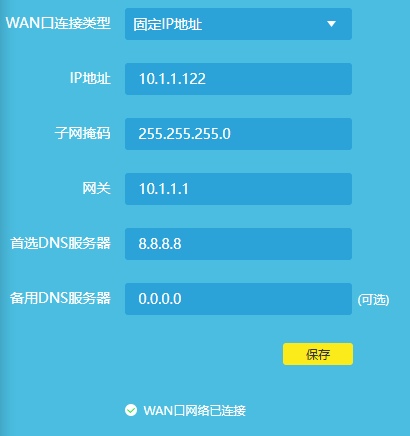
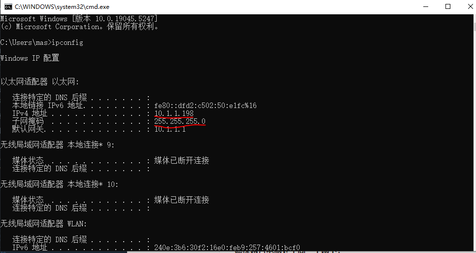

# NOKOV-Crazyswarm使用指南

## 1 刚体建立

1. 在待建立的刚体上至少牢固贴上3个反光球，最好是4到5个。

2. 打开XINGYING软件，并处于实时播放模式。在看到需要建立刚体的反光球后，冻结帧。

3. 按住`shift`，点击鼠标左键框选需要建立刚体的小球后，鼠标右键-创建刚体。单个飞机的情况下，“**跟踪对象**”选择“单个”，“**MarkerSet**”名称设置为"cfx"，x为飞机编号。**骨骼朝向**为默认的“Y”即可。

   > 如果需要为自主无人机创建刚体，建议令机头方向与动捕坐标系的X轴方向重合，同时骨骼朝向设置为X。

4. 点击“创建”即可完成刚体创建，在右侧“资产”可以查看创建的刚体。取消冻结帧，即可在动捕实时画面中查看刚体的运动。


## 2 数据流连接建立

### 网络设置

#### Windows端设置

进入路由器管理页面，将其WAN口连接类型设置为“固定IP地址”，可以按照以下地址进行设置：



**确保两台电脑处于同一子网下！**

首先确保两台电脑至少满足以下一种情况：

1. 连接同一wifi网络
2. 连接同一有线网络（网线需要插在同一交换机或同一路由器中）

随后在动捕软件端电脑，打开命令行查看其ip地址：



随后在crazyflie端（Ubuntu），bash中输入`ifconfig`查看本机IP，确认IP为`10.1.1.xxx`，此时两台电脑即位于同一子网下。若Ubuntu此时IP为`10.xxx.xxx.xxx`，可通过手动设置ip的方式进行修改。

测试（Ubuntu下）：

```bash
ping 10.1.1.198 # 动捕端IP
```

能够ping通则网络基础设置完成。


### 动捕软件端

开启vrpn：XINGYING软件左侧

* “数据广播”-“SDK流”，选择“开启”
* “VRPN”流，调整需要传输的数据及单位后，选择“开启”


### crazyflie端（Ubuntu）

> 以Ubuntu20.04 + ROS Noetic为例，crazyswarm相关配置见实验室GitHub

安装vrpn：

```bash
sudo apt-get install ros-noetic-vrpn
sudo apt-get install ros-noetic-vrpn-client-ros
```


测试vrpn连接，server ip为动捕端的ipv4地址：

```bash
roslaunch vrpn_client_ros sample.launch server:=10.1.1.198
```

若连接成功，会出现以下提示：

```bash
[INFO][17359020047.456432110]: Found new sender: cf3
[INFO][17359020047.456433548]: Creating new tracker cf3
```


## 3 Crazyswarm脚本启动

⚠️启动前请注意：

1. 在crazyradio插入电脑usb口后，请确认已赋予usb口权限：

   ```bash
   lsusb # 查看usb设备，crazyradio对应Nordic Semiconductor....。请记录其对应的Bus id及Device id
   sudo chmod 777 /dev/bus/usb/bus_id/device_id # bus_id及device_id对应自己设备的情况
   ```

2. 配置crazyswarm：

   1. 运行`rosrun crazyfile_tools --address=0xE7E7E7E703`。地址形式为`0xE7E7E7E7<X>`，`X`为无人机编号的十六进制，从而获得对应crazyflie的uri：

      ```bash
      radio://0/channel_id/2M/0xE7E7E7E7<crazyflie_id>
      ```

   2. 修改配置文件：在`crazyswarm/ros_ws/src/launch/`下的`crazyflies.yaml`及`allCrazyflies.yaml`文件中修改channel及id，与`channel_id`及`crazyflie_id`匹配。

   3. 修改配置文件：相同路径下的`hover_swarm.launch`及`mocap_helper.launch`文件中，`motion_capture_type`设置为`vrpn`，`motion_capture_host_name`为动捕端的ipv4地址。

   4. 修改配置文件：相同路径下的`hover_swarm.launch`中，`object_tracking_type`设置为`motionCapture`。


在完成相关设置后，测试连接：

```bash
roslaunch crazyswarm mocap_helper.launch
```

若连接成功，将可以得到刚体数据，包含位置、四元数等