# NOKOV Settings

## 一、Nokov 环境安装

### 1.1 软件安装

- 右键以管理员身份运行，安装XINGYING 3.4.0.4088 软件版本
- 安装完成，右击快捷方式，点击属性，兼容性
  - 勾选`以管理员身份运行`
  - 点击`更改高DPI设置`，勾选`替代高DPI缩放行为`，下拉选项设置为`系统`
  - 确定保存

### 1.2 防火墙设置、IP设置

1. 控制面板\系统和安全\Windows Defender 防火墙，点击左侧`启用或关闭Windows Defender 防火墙`，专用和公用都设置为关闭

2. 控制面板-网络和Internet-网络和共享中心-更改适配器设置

- 插入网线-右击以太网-右击属性-Internet协议版本4（IPv4）设置如下

  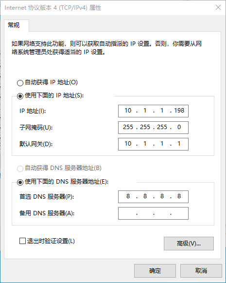

### 1.3 系统标定

- 选择工作路径（软件会自动打开历史工作路径），右下角确认工作路径，链接镜头

  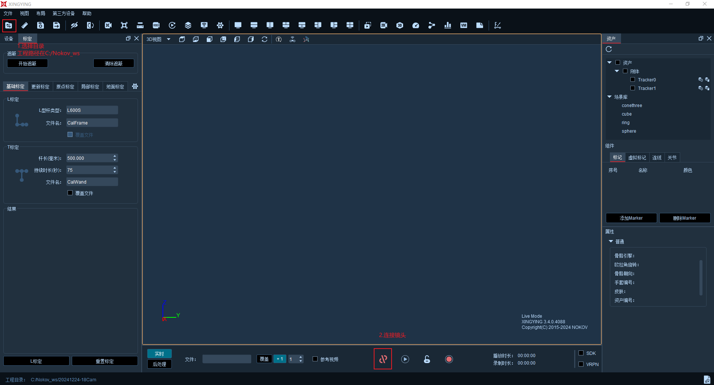

- 镜头硬件位置角度调节（已经设置）

**以下为具体标定步骤（重新标定也是以下步骤）** 

**请勿随意调整遮蔽、以及各个相机的阈值！！！** 

- 清除反光材料：金属桌椅、地板反光（**铺设地毯地垫**）、室外光（拉上窗帘）等

- 切换视图为`2D视图`，双击任意位置可以在显示`单镜头界面`和`所有镜头界面`切换

- 遮蔽环境中的杂点、噪点

  禁止使用左侧`标定-遮蔽` 菜单中的`开始遮蔽`按钮，会导致软件崩溃！！！

  正确做法：按住鼠标中键，框选噪点，形成遮蔽框

  需要删除遮蔽框：选中遮蔽框，右键删除，完成如下图

  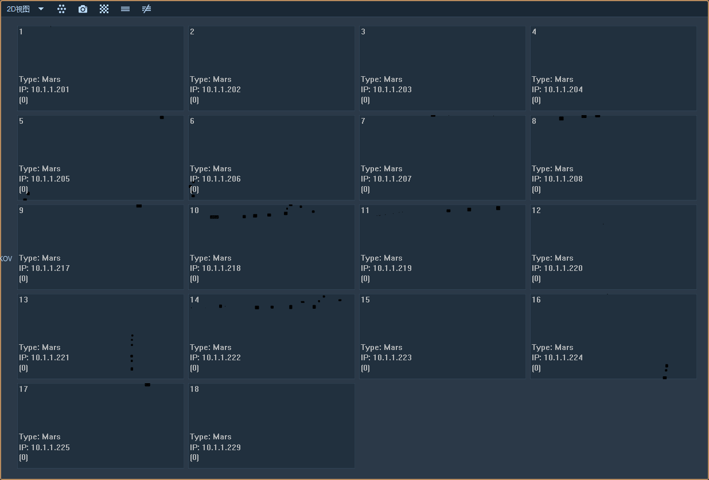

- 开始标定

  - 设置标定杆参数，标定轴向为Z轴

    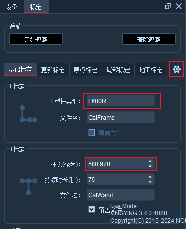

  - 将L型标定杆置于场地内，保证**至少1/4数量**镜头可以完整看到标定杆的**4个marker球**

    **坐标系方向定义为：标定杆长、短边依次为x轴、y轴，z轴向上**

  - 调整阈值，保证画面标定杆marker点不闪动，且滤除噪点

    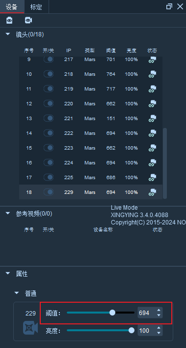

  - **L标定：**点击左下角`L标定`，结束后会显示有多少个相机满足L标定

    不断调整各相机的阈值，保证画面最佳

  - **T标定：**设置杆长为实际T型杆上的数字（前面已设置），点击按钮开始，在场地中不断挥动T型杆，直至结束，

    > **需要让所有镜头的有效帧都大于1000**

  - 保存标定文件，覆盖setup文件

# 二、新版本XINGYING（4.3.0）标定说明

### **注：**

**1、标定前，在桌面Nokov_ws里面的Nokov_Calibration_Results新建一个文件夹**，命名为日期即可，然后在XINGYING软件中选择目录

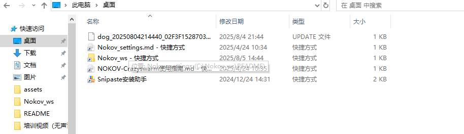

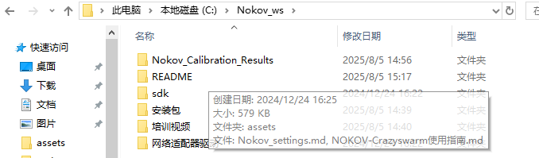

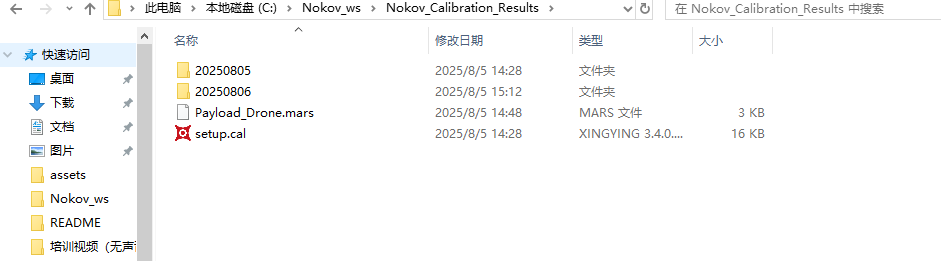

**2、**标定前把场地所有的反光物体拿出来。

### 一、加载标定文件

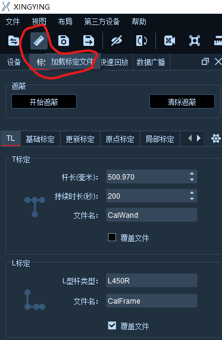

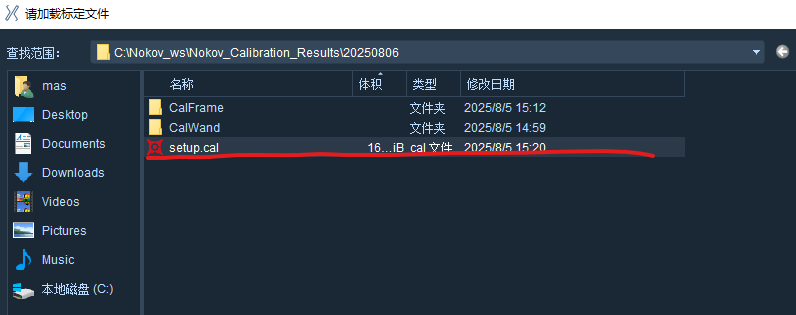

### 二、标定

标定摄像头外参和设置原点用**TL标定**

标定摄像头外参用**更新标定**

**TL标定**

在完成遮挡后，点击TL标定，首先先用T型杆对摄像头的外参进行标定，标定完成计算外参，如下图：

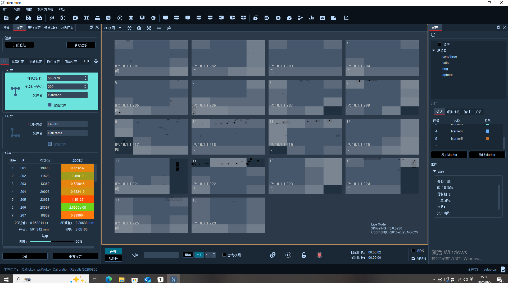

解算完成后，进行L标定，用L型杆设定坐标原点。

点击L标定后，会提示“确定你的L型杆类型”，这个**只是提示**，实验室的L型杆是L450R的，点击确认后，再点击L标定即可进行原点设定。

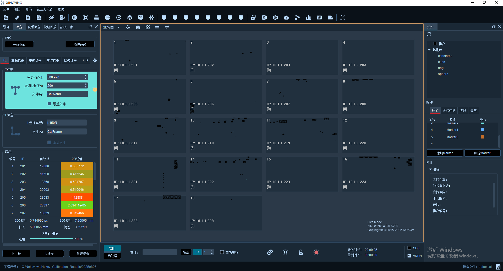

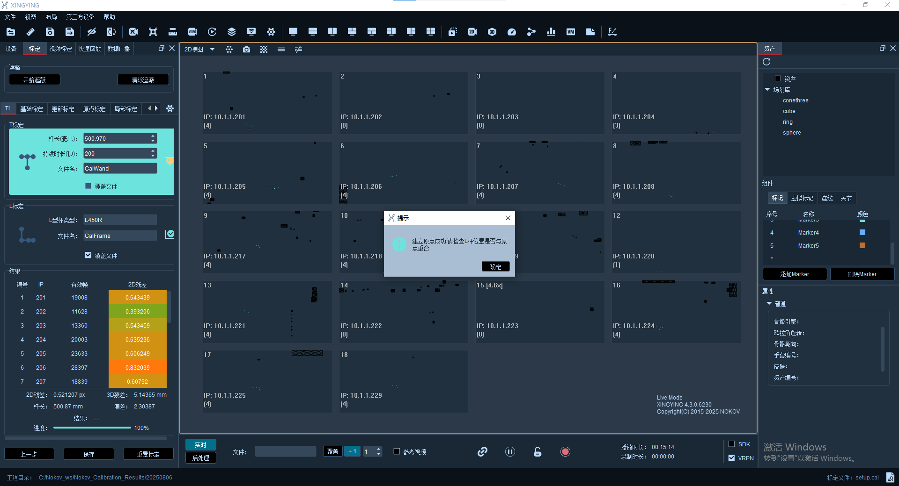

### 三、动捕系统网络配置（如何使用机载电脑订阅动捕数据）

将动捕系统交换机网线连接到TP LINK 8E3D，动捕的数据将广播到所有连接到WIFI的设备当中。

该路由器需要通过管理员界面（tplogin.cn，密码8个2）配置到192.168.0网段，因此动捕主机需要配置到同样网段下，机载电脑连接到该TPLINK网络，ping通动捕主机，订阅数据即可拿到位姿信息。

动捕软件设置如图，需要开启VRPN流

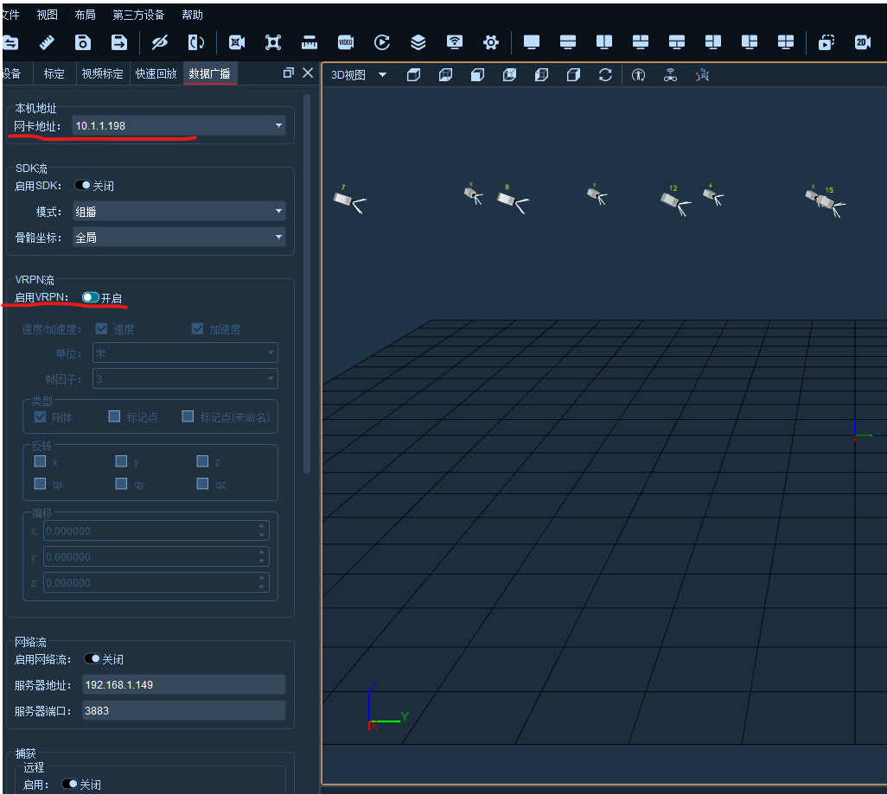

