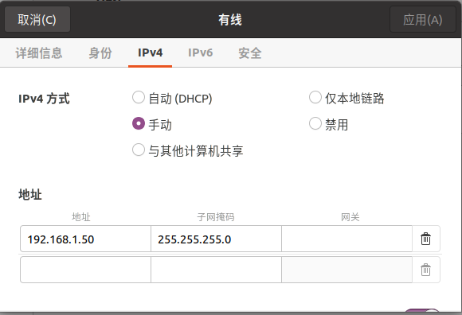
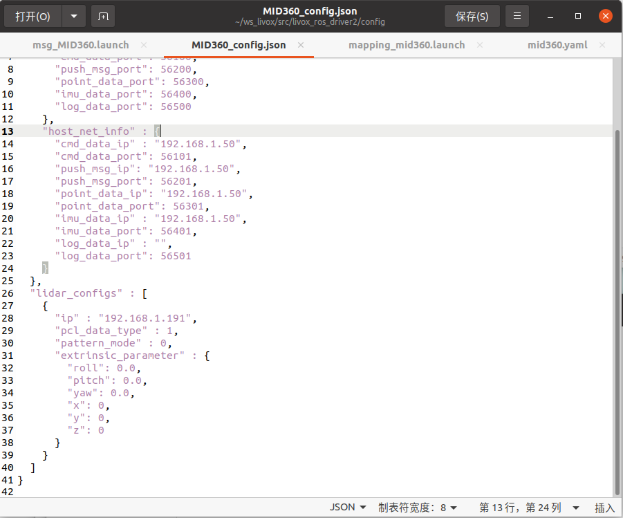
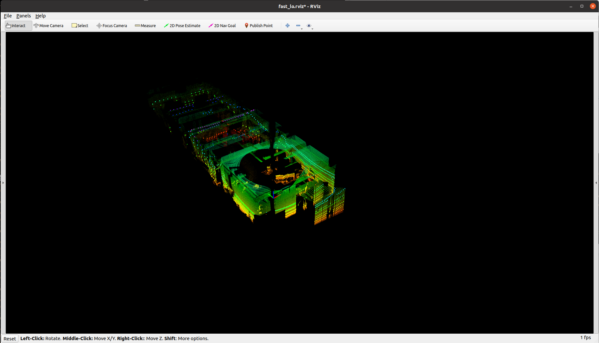
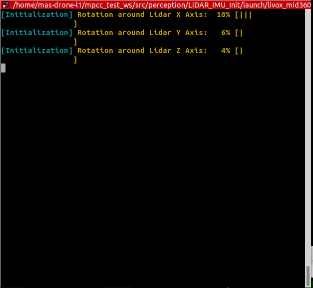
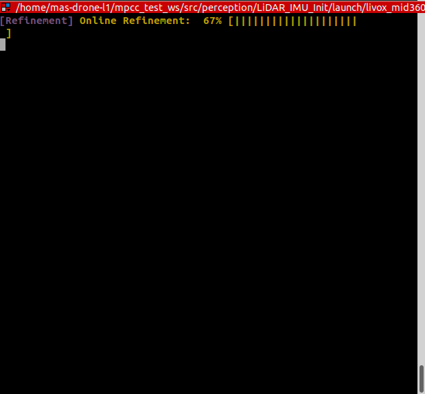
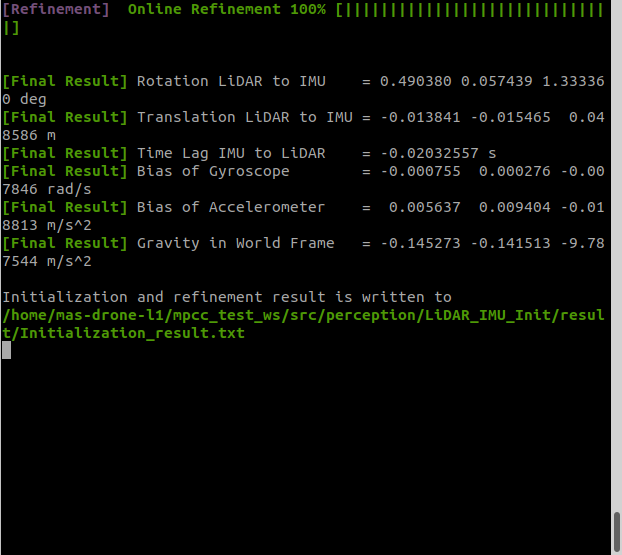
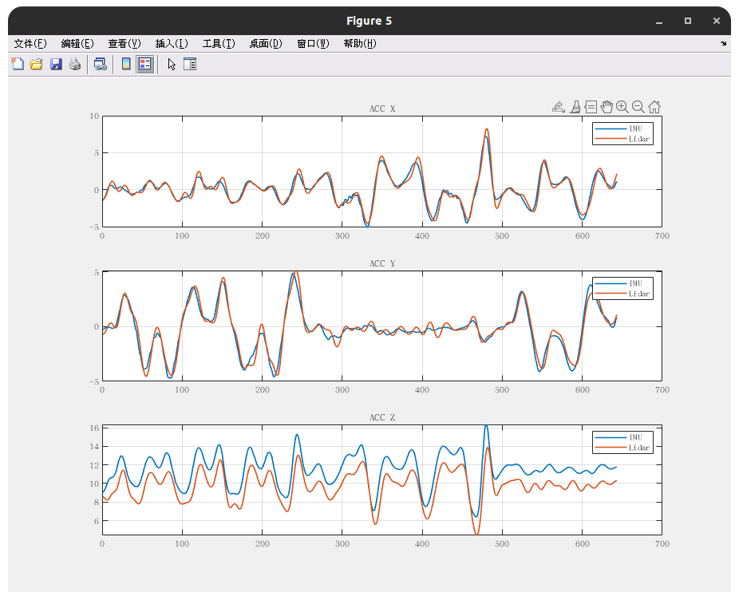
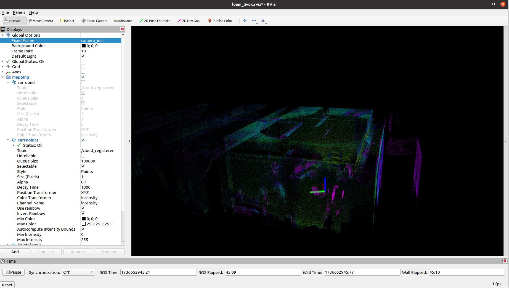

# Livox MID-360配置与fast-lio2使用指南

> 以下教程以Ubuntu20.04 + ROS Noetic为例，请各位同学根据自己实际情况参考本教程。

## 1. 硬件连接

### 非机载情况

采用原装的一分三航插线，自行在电源线端焊接XT60公头。随后RJ45网口端与电脑相连，XT60接口与4S锂电池相连。


### 机载情况

采用从tb无名创新购买的一分二航插线。RJ45网口端与NUC或NX连接，电源端可直接焊接至分电板XT60公头焊接的位置。


### IP设置

插入网线后进入Ubuntu系统，对有线连接进行设置。IPv4方式选择`手动`，ip地址设置为`192.168.1.50`，子网掩码为`255.255.255.0`



## 2. Livox-ROS-Driver2及Livox-SDK2安装

> 本教程直接安装更新的Livox ROS Driver2及Livox-SDK2。如需安装Livox ROS Driver及Livox-SDK1请参考https://github.com/hku-mars/FAST_LIO?tab=readme-ov-file

在安装之前，请确保本机已经安装MAVROS。

### Livox-SDK2

https://github.com/Livox-SDK/Livox-SDK2

```bash
$ git clone https://github.com/Livox-SDK/Livox-SDK2.git
$ cd ./Livox-SDK2/
$ mkdir build
$ cd build
$ cmake .. && make -j
$ sudo make install
```


:warning:注意：如果需要删除SDK，可运行以下命令：

```bash
$ sudo rm -rf /usr/local/lib/liblivox_lidar_sdk_*
$ sudo rm -rf /usr/local/include/livox_lidar_*
```


### Livox ROS Driver2

https://github.com/Livox-SDK/livox_ros_driver2

完成SDK安装后，进行driver的安装。

```bash
$ git clone https://github.com/Livox-SDK/livox_ros_driver2.git ws_livox/src/livox_ros_driver2
$ source /opt/ros/noetic/setup.sh
$ ./build.sh ROS1
```


若需要长期使用激光雷达，建议在`~/.bashrc`文件中添加以下命令：

```bash
source ~/ws_livox/devel/setup.bash
```


### 测试

首先修改`~/ws_livox/src/livox_ros_driver2/config/MID360_config.json`：

1. 将`"host_net_info"`中的4个ip地址修改为`192.168.1.50`

2. 将`"lidar_configs"`中的`"ip"`改为`192.168.1.1xx`，xx为MID360雷达上航插口旁序列号的最后两位。

   

3. 随后运行：

   ```bash
   $ source ~/ws_livox/devel/setup.bash
   $ roslaunch livox_ros_driver2 msg_MID360.launch
   $ roslaunch livox_ros_driver2 rviz_MID360.launch
   ```

若rviz中出现点云图像，则连接配置成功。


## 3. fast-lio2

### 安装

原生版本参考https://github.com/hku-mars/FAST_LIO?tab=readme-ov-file

下载fast-lio源码：

```bash
$ cd ~/$A_ROS_DIR$/src
$ git clone https://github.com/hku-mars/FAST_LIO.git
$ cd FAST_LIO
$ git submodule update --init
```

随后需要手动进行以下修改：

* ==对`CMakelists.txt`进行修改==：将`find_package`中的`livox_ros_driver`修改为`livox_ros_driver2
  `。
* ==对`package.xml`进行修改==：将`<build_depend>livox_ros_driver</build_depend>`修改为`<build_depend>livox_ros_driver2</build_depend>`；将`<run_depend>livox_ros_driver</run_depend>`修改为`<run_depend>livox_ros_driver2</run_depend>`
* 将==`FAST_LIO/src/preprocess.h`==及==`FAST_LIO/src/laserMapping.cpp`==中的`#include <livox_ros_driver/CustomMsg.h>`修改为`#include <livox_ros_driver2/CustomMsg.h>`
* 将==`FAST_LIO/src/preprocess.h`== 、==`FAST_LIO/src/preprocess.cpp`==、==`FAST_LIO/src/laserMapping.cpp`==中的命名空间`livox_ros_driver::`修改为`livox_ros_driver2::`.

最后进行编译：

```bash
# 在工作空间下
$ source ~/ws_livox/devel/setup.bash
$ catkin_make
```


:warning:注意：若编译过程中报错，提示找不到fast_lio/Pose6D，请在Cmakelists中`find_package`最后添加`genmsg`。


### 雷达外参标定

> 若只需雷达作为参考，MID-360甚至可以不需要标定或采用雷达内置的imu。但如果需要LIO作为无人机状态估计来源的话，建议采用飞控的imu数据。

使用HKU-MarS Lab的标定工具**LI_Init**：https://github.com/hku-mars/LiDAR_IMU_Init?tab=readme-ov-file

下载源码：

```bash
$ cd ~/catkin_ws/src
$ git clone https://github.com/hku-mars/LiDAR_IMU_Init.git
```

为适配Livox ROS Driver2，同样需要将`Cmakelists.txt`、`package.xml`及源代码中的`livox_ros_driver`改为`livox_ros_driver2`

修改完成后编译：

```bash
$ cd ..
$ catkin_make -j
$ source devel/setup.bash
```


编译完成后，修改参数文件`/config/mid360.yaml`：

* `imu_topic`：雷达内置imu topic为`/livox/imu`，飞控的imu topic一般为`/mavros/imu/data_raw`。若采用飞控imu数据请确保其频率大于150Hz。
* `cut_frame_num`与`orig_odom_freq`：未修改雷达驱动情况下直接采用默认值即可。官方推荐使用Livox系列雷达时二者乘积为50。
* `mean_acc_norm`：采用飞控imu时改为9.805，使用内置imu改为**1**。
* `gyr_conv`：MID-360可改为20~50左右。
* `acc_conv`：MID-360可改为2左右。


运行：

```bash
$ source devel/setup.bash
$ roslaunch lidar_imu_init livox_mid360.launch
```


请先静置雷达5秒以上，等待算法生成较为稠密的初始地图：



随后拿起雷达，并按照进度提示，手持雷达进行旋转。建议参考视频：https://www.bilibili.com/video/BV1ZS4y127mW/?spm_id_from=333.337.search-card.all.click中的方式，绕三个轴画弧线



在线优化阶段，继续绕三个轴画弧线，直到优化完成：



标定成功：



最后的标定结果会存储在`/LiDAR_IMU_Init/result/`文件夹下的`Initialization_result.txt`文件中。将**Initialization result**中相关参数填入fast-lio中`/config/mid360.yaml`文件中，标定完成。

以下为关键参数：

* time_offset_lidar_to_imu
* extrinsic_T
* extrinsic_R （从Homogeneous Transformation Matrix from LiDAR to IMU中的前三行三列）

> IMU bias及重力会在fast-lio中在线优化，无需填写

可以多优化几次，对比initialization的结果的一致性。translation的结果可能会有厘米级别的偏差，但算法本身对translation的精度要求不大，可以结合实际测量的结果填写。time offset大概在10ms左右（pixhawk 6C飞控）。

如果对结果没有信心，请在安装了Matlab的电脑上运行分析代码：

```bash
$ matlab /src/LiDAR_IMU_Init/matlab_code/result_plot.m
```

主要观察三轴的ACC



### 其他参数设置

在`mapping_mid360.launch`中：

* `filter_size_surf`：
  * 室外使用：0.5
  * 室内使用：0.05~0.15
* `filter_size_map`：
  * 室外使用：0.5
  * 室内使用：0.15~0.25


### 运行

```bash
$ source devel/setup.bash
$ roslaunch livox_ros_driver2 msg_MID360.launch
$ roslaunch fast_lio mapping_mid360.launch
```

> 若rviz中无点云显示，请将frame改为camara_init




### PX4 POSITION模式设置

使用光流及激光定位信息：修改`EKF2_AID_MASK`为10

在**启动fast-lio后**，运行`lidar_to_mavros`功能包，使用`/mavros/vision_pose/pose`话题，将激光得到的定位信息传输至PX4进行融合。

> :warning:注意：该话题基于ENU坐标系

在初次基于LIO进行POSITION模式飞行前，请先进入QGC进行检查。在Analyze Tools - MAVLink检测中，查看`LOCAL_POSITION_NED`信息，并结合`/Odometry`话题进行对比，检查定位信息是否正确传输及转换。

最后在调整好控制器参数后，可以以POSITION模式起飞及操作。
