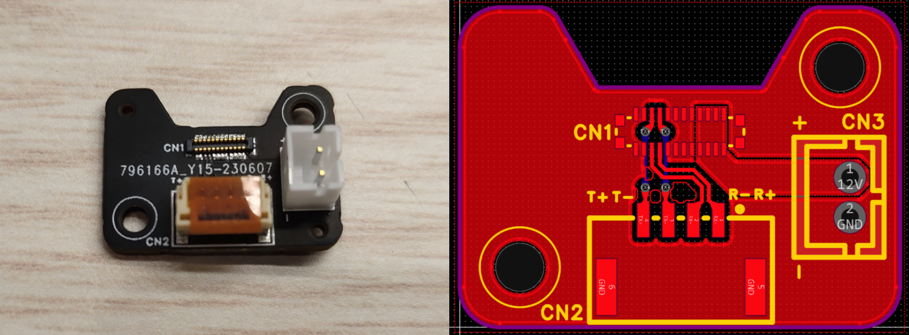
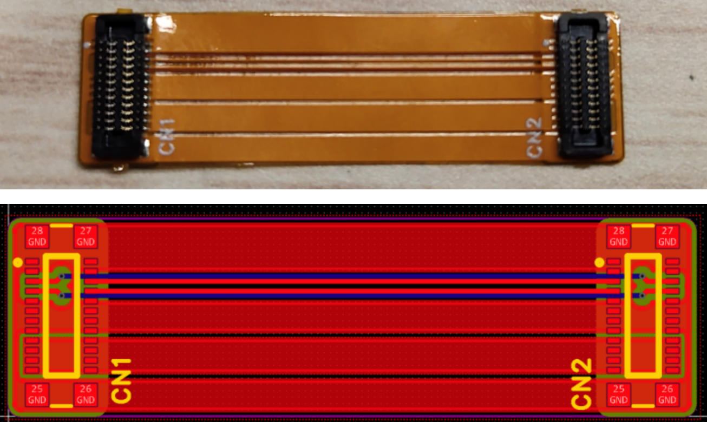
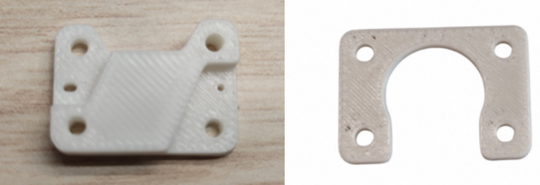
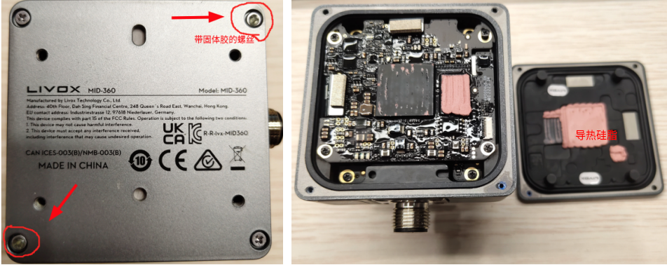
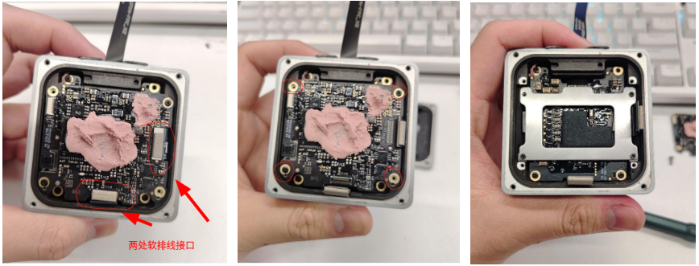
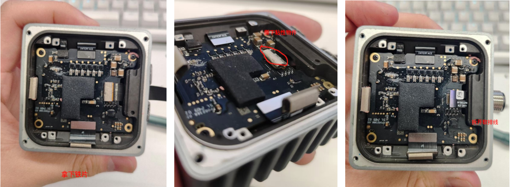
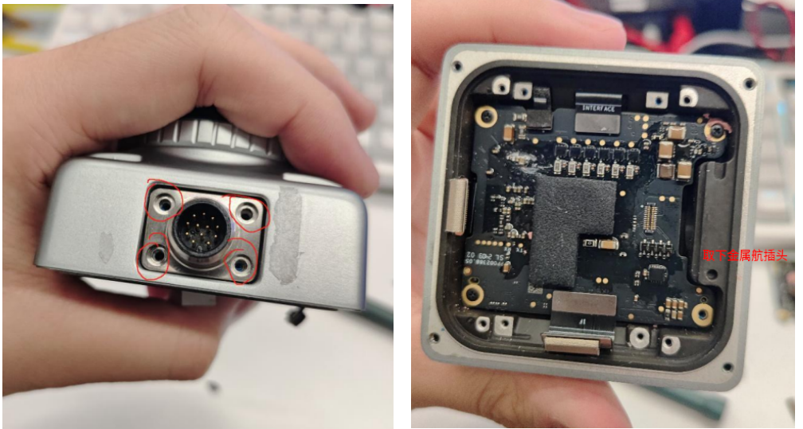
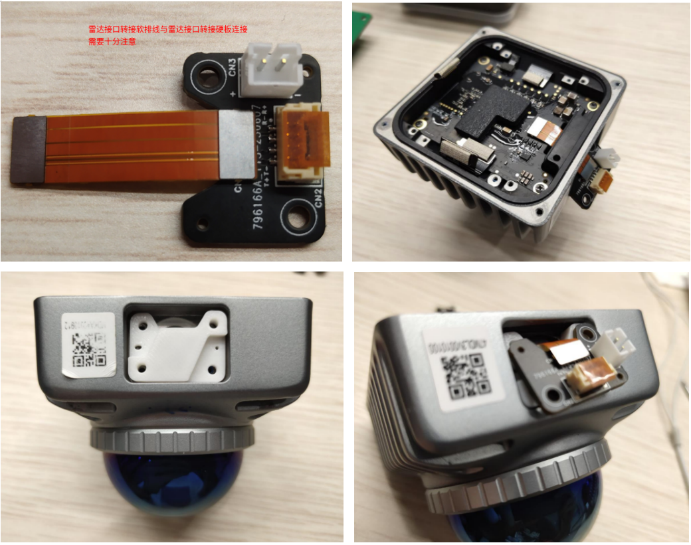

# Mid360雷达接口更换指南

## 物品准备

下面的 **2 3 4** 可通过[购买](https://item.taobao.com/item.htm?_u=k2098ten2ibd9d&id=921986747911&pisk=gQTaT8AixuUQs2wI5pQ4aYO7U6QOyZkSnE6fiIAc1OXiD1g0uIRlGfHx6H5Dhphx6NOc3KJCpr1jXxU2LdOkfG9XftfcKpA_5tgO0KRWeKajWh10upOAmKT2Mr5DiKhOhfnB6CQAoYMW34O96oFkaiYNiMVH9s1GsDsgb2RsOYMSPqWBiH8KFK1IR8-ha_bcsi4gKX5fgt2DnG4h-9CAiRf0SXRhp9fgstfDtMfli-b0jibn-1C7Ir4gjwbhpsbciKbmTwXdiZXDnZDXICA08_siOC4vxG05QGWks9zy9e5iJTuRKrDy-1RFHCmYorYF_G8nZ_L6PZ-Dwn7c8f0D6L6dmGvnRP72tsJ1dL0u8wA6N3_MljZA_nAW53vxVkQwihvAYdHLY9tHWIXcvS4WTgTwes8gpXjBtOQGwHkzWNOPLNTFkSqN53OWkgYi78BC2sJ1dL0u8wA6N3_MljZA_nAW5nSyg-C3RV8vb-qVj6CFFXlUv40iQcVu2qEYDMbRTTG11oEAjTfFFXPzDoIhh6WS1q1..&spm=a1z09.2.0.0.77802e8dVki7kz)或者自行设计的方式（本人未设计但提供部分资料）获得：

1. mid360雷达*1

2. 雷达接口转接硬板*1

   **雷达接口转接硬板CN2（GH1.25）接口从左往右的线序为TX+，TX-，RX-，RX+。雷达接⼝转接硬板上的GH1.25mm 1 * 4p接⼝是信号接⼝，PH2mm 1 * 2p是供电接⼝，板上有对应的丝印，可⾃⾏设计连接线。两个孔径适配M2螺丝。芯片具体尺寸及布局可以从原来雷达金属航插头来估计推算。**

3. 雷达接口转接软排线*1

   **雷达接口转接软排线的CN1端连接到雷达第二层电路板，CN2端连接雷达接口转接硬板的CN1。**

4. 雷达接口支撑打印件*1（支撑防短路，solidworks自行设计）四个孔径适配M2螺丝，打印件厚度根据雷达接口转接硬板厚度以及M2螺丝长度来设计（雷达该位置自带的M2\*6mm螺丝厚度选用1-2mm就行）。具体尺寸及布局可以从原来雷达金属航插头来估计推算。

## 拆解雷达

1.出厂的mid360雷达的螺丝上有固体胶，可以用尖锐物品挑去，用螺丝刀卸下螺丝（**注意整个拆解雷达流程共有多种不同型号螺丝，拆装不能混用**），**卸下螺丝**和**拆下雷达金属底板**的时候注意要**垂直操作**，不然会导致底板与雷达内部电路板芯片之间**导热硅质**分离的完整性太差，影响雷达导热效率。

2.开始拆卸第一层电路板，首先，将第一层电路板的**两处软排线接口**拆开；然后，卸下第一层电路板的螺丝，**千万注意不要让四颗小螺丝滑牙了**。拿开第一层电路板如图所示。

3.卸下铁片，拆开**软排线接口**，然后把**雷达航插软排线上的粘性物件**撕下保留，后续需要**贴在更换的软排线**上。

4.卸下雷达金属航插头上的螺丝并拆下金属航插头。

5.并接入**“物品2雷达接口转接硬板”**、“**物品3雷达接口转接软排线**”和**“物品4雷达接口支撑打印件”**：

5.1.如果是网上购买：主要是根据商家提供资料，不同商家可能不一样，**这一步非常重要，接线很容易接错**。

首先将**雷达接口转接软排线**和**雷达接口转接硬板**连接，注意**雷达接口转接软排线**上**雷达端**连接**雷达第二层电路板**，**板端**连接**雷达接口转接硬板**，**千万要注意板端的连接方向，千万不能接错，千万不能接错，千万不能接错，如图所示，或者多询问商家接线正确与否**。然后将**雷达接口支撑打印件**放到**雷达接口转接硬板**和**雷达**之间上好螺丝。

5.2.如果是自行设计，**雷达接口转接软排线**上的**CN1端**连接到**雷达第二层电路板**，并贴上**前面保留的粘性物件**，**CN2端**连接到**雷达接口转接硬板**上的接⼝，**注意CN2端连接雷达接口转接硬板千万不能接错，千万不能接错，千万不能接错，建议检查对比电路设计图纸及下列图片**。放入**雷达接口支撑打印件**，上好螺丝。

6.接口替换完成后，按照拆卸顺序将雷达配件装回，记得检查并装回第一层雷达电路板和第二层雷达电路板的软排线，注意配件方向和定位孔。

## 拆解雷达额外处理

1.将雷达金属底板装回的时候可以将四颗十字螺丝替换成M2*6mm的内六角螺丝。

## 验证环节

1.将换好雷达接口的Mid360上电一小段时间，看Mid360是否有工作（振动），若无振动说明改装有问题。

2.与电脑连接，测试FAST-LIO等雷达惯性里程计能否正常工作。