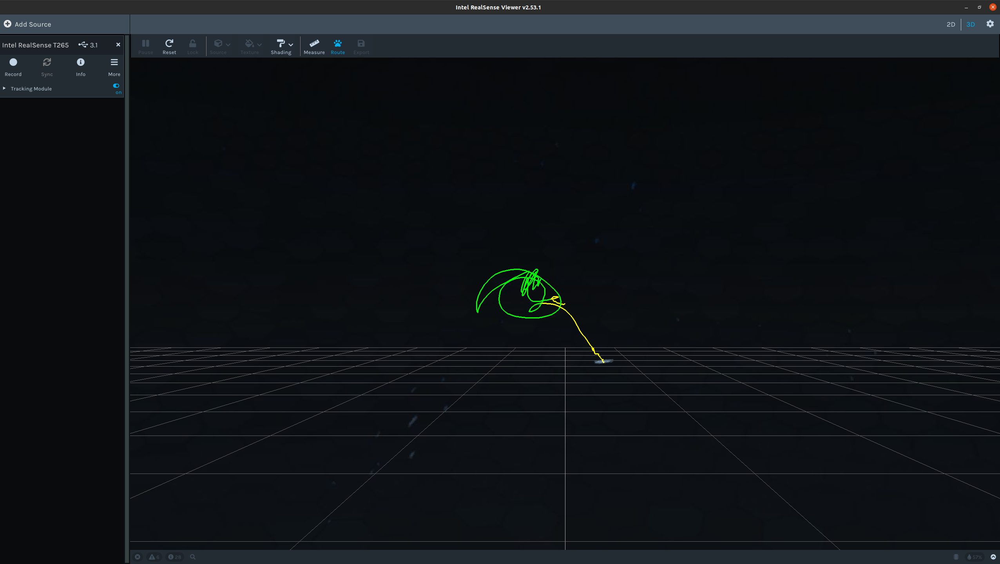
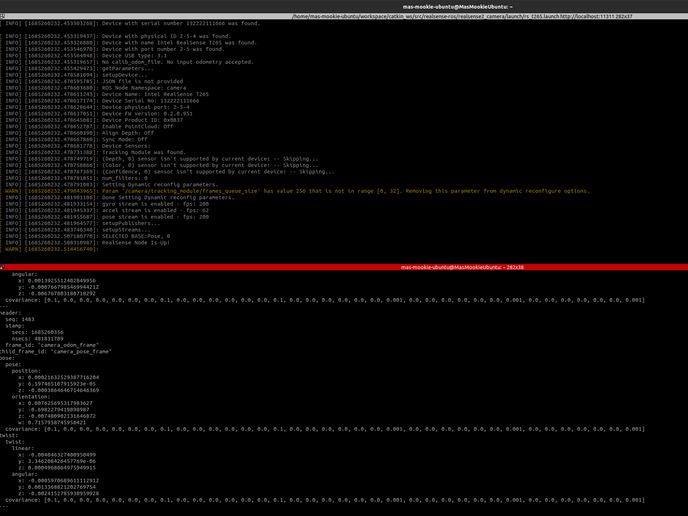

# Realsense T265 使用教程

## SDK 安装

[Linux 安装 Realsense SDK 官方教程](https://github.com/IntelRealSense/librealsense/blob/master/doc/distribution_linux.md)

按顺序在终端执行以下指令

```bash
sudo apt-key adv --keyserver keyserver.ubuntu.com --recv-key F6E65AC044F831AC80A06380C8B3A55A6F3EFCDE || sudo apt-key adv --keyserver hkp://keyserver.ubuntu.com:80 --recv-key F6E65AC044F831AC80A06380C8B3A55A6F3EFCDE

sudo add-apt-repository "deb https://librealsense.intel.com/Debian/apt-repo $(lsb_release -cs) main" -u

sudo apt-get install librealsense2-dkms
sudo apt-get install librealsense2-utils
sudo apt-get install librealsense2-dev
sudo apt-get install librealsense2-dbg
```

安装完成后，电脑重新连接 T265 相机，在终端运行`realsense-viewer`来查看是否安装成功。

打开`realsense-viewer`后，打开屏幕左边的`Traking Module`开关，即可看到实际轨迹。

实际效果图像如下



## ROS 驱动安装

[Realsense T265 ROS 驱动包官方仓库](https://github.com/IntelRealSense/realsense-ros)

安装与编译：按顺序执行以下指令

```bash
sudo apt install ros-noetic-realsense2-camera

cd ~/catkin_ws/src
git clone git@github.com:IntelRealSense/realsense-ros.git
git switch ros1-legacy
cd ..
catkin_make
```

运行：按顺序执行以下指令

```bash
cd ~/catkin_ws
source devel/setup.bash
roslaunch realsense2_camera rs_t265.launch
```

打开另一个终端执行:

```bash
rostopic echo /camera/odom/sample
```

即可看到 T265 的 Odom 输出，实际效果如下图所示。


