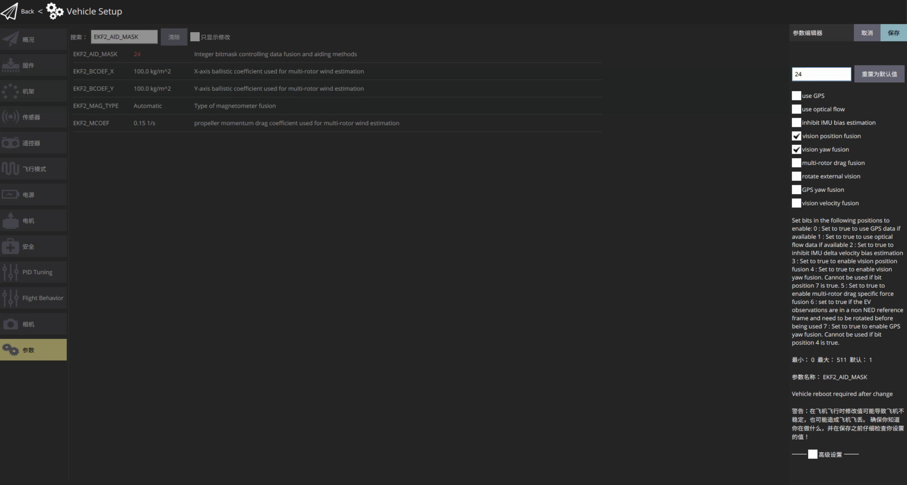
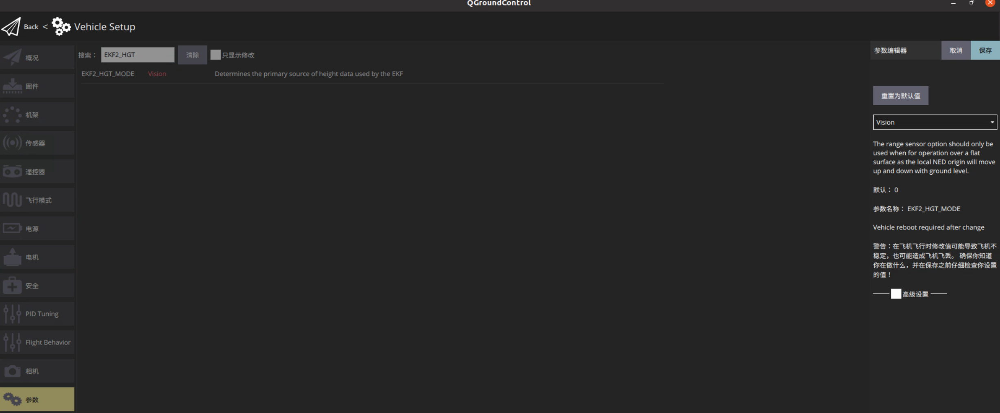
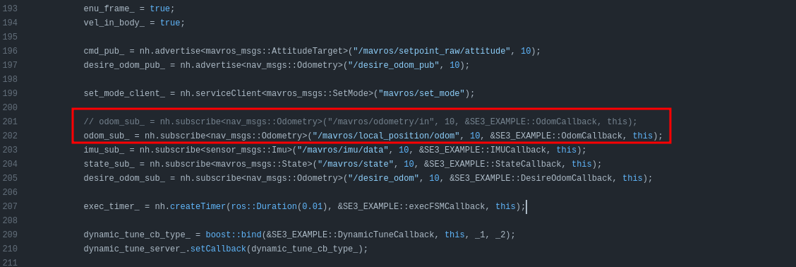
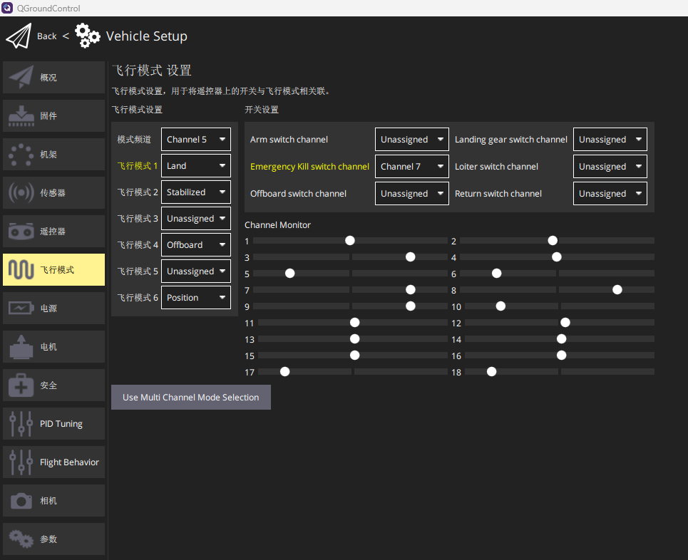
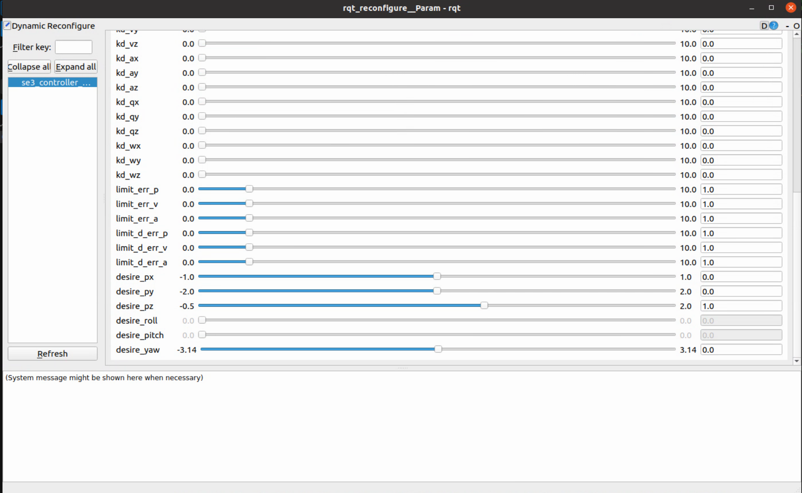

# UAV 使用动捕定位和运行SE3控制器例程

## 先决条件

1. 按照[无人机安装教程视频](https://www.bilibili.com/video/BV1WZ4y167me)完成无人机的安装、飞控参数和遥控器配置，并通过遥控器完成无人机的手控飞行。
2. 在 QGC 配置飞控参数时，搜索`CHK`，把所有安全检查相关的项设置为`disable`。
3. 无人机搭载 NUC 电脑，并将飞控与 NUC 电脑连接。
4. NUC 电脑上完成 ROS 和 Mavros 的安装。

## 环境设置

1. 在 NUC 电脑上克隆实验室 Github 的两个仓库：[mavros_vicon_bridge](https://github.com/HITSZ-MAS/mavros_vicon_bridge)和[se3_controller](https://github.com/HITSZ-MAS/se3_controller).

    ```shell
    sudo apt-get install ros-noetic-mavros*

    mkdir -p catkin_ws/src
    cd catkin_ws/src
    git clone git@github.com:HITSZ-MAS/mavros_vicon_bridge.git
    git clone git@github.com:HITSZ-MAS/se3_controller.git
    ```

2. 按照`mavros_vicon_bridge`的`README.md`对地面站参数进行修改
    1. 将`EKF2_AID_MASK`设置为`24`(仅选择`vision position fusion`和`vision yaw fusion`).

        

    2. 将`EKF2_HGT_MODE`仅选择`Vision`.

        

3. 打开 Vicon 动捕系统，并在 Vicon 中创建无人机对象。（参见 Vicon 动捕教程）
    * 注意：建立刚体的时候，机头要对准 vicon 坐标系的 x 轴正方向。

4. 修改`mavros_vicon_bridge`仓库`launch`文件夹的`mavros_vicon_bridge.launch`文件
    * 修改第 6 行，设置 Vicon 的 IP 地址

        ```js
        # 修改前
        <arg name="datastream_hostport" default="待填写 Vicon 地址"/>

        # 修改后（以 192.168.1.11 为例）
        # Vicon 电脑的 IP 地址在路由器断电重启后，可能发生改变
        # 注意：务必事先查看 Vicon 连接电脑的IP地址！！！
        <arg name="datastream_hostport" default="192.168.1.11"/>
        ```

    * 修改第 17,18 行，设置无人机在 Vicon 动捕系统中的对象名。

        ```js
        # 修改前
        <param name="subject_name" value="对象名称"/>
        <param name="segment_name" value="对象名称"/>

        # 修改后（以对象名为 mookie_uav 为例）
        <param name="subject_name" value="mookie_uav"/>
        <param name="segment_name" value="mookie_uav"/>
        ```

5. 检查订阅的里程计话题：打开`se3_controller/src/se3_example.cpp`，翻到第201行，如下图所示

    

    * 在仿真环境中，使用`/mavros/local_position/odom`话题。
    * 在实机飞行时，使用`/mavros/odometry/in`话题。
    * **注意**：使用一个话题时，记得把另一个话题注释。

6. 编译并`source`环境变量脚本

    ```shell
    cd catkin_ws
    catkin_make -DCMAKE_BUILD_TYPE=Release -DCMAKE_EXPORT_COMPILE_COMMANDS=Yes
    source ./devel/setup.bash
    ```

7. 设置遥控器飞行模式
    1. 打开NUC上的 QGroundControl 地面站，切到飞行模式界面。

    2. 按下图所示进行设置

        

    3. 飞行模式说明
        * `Position`模式：无人机通过 Vicon 动捕系统进行定位,从而进行定点飞行。
            > 油门在中点时，无人机不动；往下移动油门，无人机降落；往上移动油门，无人机上升。
        * `Offboard`模式：由电脑向无人机输出控制指令。
        * `Land`模式：将遥控器切到该模式后，无人机将自动降落。

## 起飞前检查

第一个窗口：打开 Vicon 节点

```bash
roslaunch vicon_bridge mavros_vicon_bridge.launch
```

第二个窗口：检查话题消息是否正确

```bash
rostopic echo /mavros/odometry/in
```

移动飞机，检查里程计数据是否正确

第三个窗口：检查是否能够切到`position`模式

```
rostopic echo /mavros/state
```

用遥控器切到position模式，检查话题中mode是否变为定点模式

第四个窗口：打开控制器例程

```
roslaunch se3_controller px4_example.launch
```

第五个窗口：检查控制器输出是否正确

```
rostopic echo /mavros/setpoint_raw/attitude
```

例程默认给的期望位置为`(0,0,1)`

1. 把无人机移动到`x=y=0`的位置，且机头对准 vicon 的 x 轴正方向，检查话题中`thrust`是否为正
2. 把无人机移动到`x=1`，`y=0`的位置，且机头对准 vicon 的 x 轴正方向，检查话题中`body_rate`的 y 值是否为小于0的数值（明显小于0，而不是-0.0xx）
3. 把无人机移动到`x=0`，`y=1`的位置，且机头对准 vicon 的 x 轴正方向，检查话题中`body_rate`的 x 值是否为大于0的数值（明显大于0，而不是0.0xx）

**注意**：以上所有检查通过后，方可进行下面的飞行操作。

## 起飞

1. **安全注意事项**
    1. 起飞前，确保安全网已经全部拉上，且安全网内无人员停留。
    2. 用绳子固定在无人机机架上，保证安全。
    3. 起飞前，检查螺旋桨方向是否正确。
    4. 不要飞太高，防止无人机脱离 Vicon 捕捉范围.

2. 程序运行（`source`环境变量指令不再重复）
    * 第一个窗口：打开vicon相关节点

        ```bash
        roslaunch vicon_bridge mavros_vicon_bridge.launch
        ```

    * 第二个窗口：打开se3_controller相关节点，并出现以下窗口

        ```bash
        roslaunch se3_controller px4_example.launch
        ```

        

    * 窗口说明：`desire_px`,`desire_py`,`desire_pz`为目标位置的`xyz`；`desire_yaw`为目标姿态；修改这四个参数即可。

3. 遥控器
    * 先将`Channel 5`打到中间位置，即`Land`模式。
    * 解锁无人机飞控。
    * 再将`Channel 5`打到`offboard`模式即可，无人机应当会飞到对应位置。
        > **注意**：（切到offboard模式后有可能电脑死机，导致无人机一飞冲天，要做好时刻切land模式的准备！！）
    * 调整上面窗口的四个参数，无人机会移动到对应位置。

4. 降落：将遥控器的`Chanbel 5`打到`Land`模式，无人机降落。
