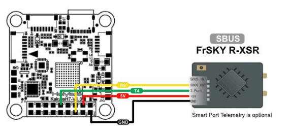
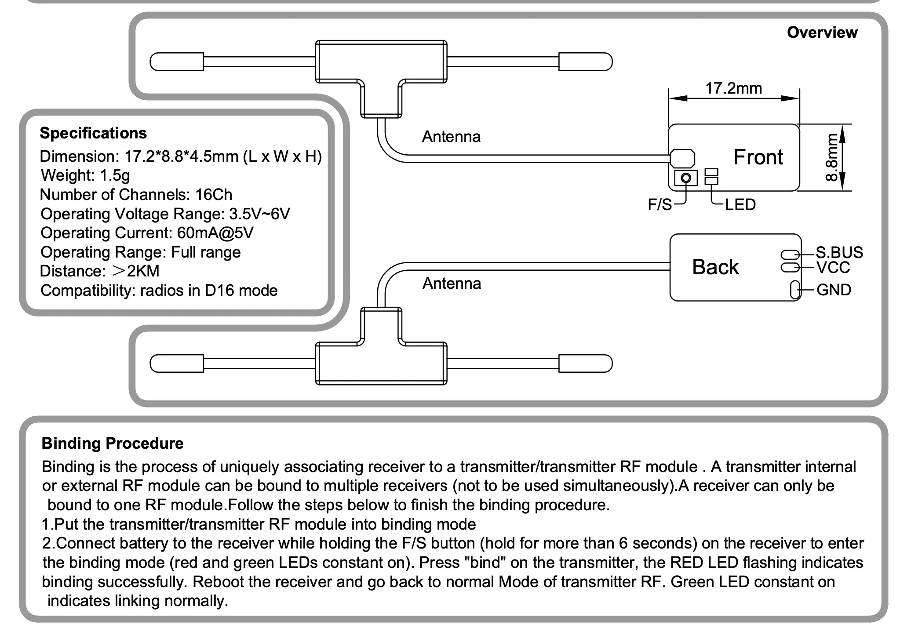

# Holybro Kakute H7 飞控板有关配置

## 固件烧写

主要参考文献：[Kakute H7 刷写 px4 固件 -CSDN博客](https://blog.csdn.net/qq_44998513/article/details/131630998)， [Holybro Kakute H7 | PX4 Guide (main)](https://docs.px4.io/main/en/flight_controller/kakuteh7.html#holybro-kakute-h7)。

根据 [Holybro Kakute H7 | PX4 Guide (main)](https://docs.px4.io/main/en/flight_controller/kakuteh7.html#holybro-kakute-h7) 的说明：

```
The board comes pre-installed with Betaflight. Before PX4 firmware can be installed, the PX4 bootloader must be flashed. 
```

为了烧写 bootloader，我们需要首先从源码编译 bootloader。

### 源码编译

在命令行中键入以下代码：

```bash
git clone --recursive https://github.com/PX4/PX4-Autopilot.git
```

如果 clone 过程没有任何错误，直接进行下一步；否则，可考虑运行

```bash
git submodule update --init --recursive
```

clone 完成后，键入以下代码：

```bash
cd PX4-Autopilot
make holybro_kakuteh7_bootloader
```

如果出现报错

```bash
arm-none-eabi-gcc: Command not found
```

则先安装交叉编译包

```bash
sudo apt-get install gcc-arm-none-eabi -y
```

编译过程中，如果出现报错 ModuleNotFoundError，例如（下面的 xxx 随报错信息而有差异）

```bash
ModuleNotFoundError: No module named 'xxx'
CMake Error at xxx:
  xxx is not installed or not in PATH

  please install using "xxx"
```

则按照形如上述最后一行的提示，先安装依赖。例如

```bash
sudo pip3 install --user kconfiglib
```

在安装依赖过程中，如果出现下面报错

```bash
sudo: pip3: command not found
```

则先安装 python3-pip

```bash
sudo apt-get install python3-pip -y
```

总之，缺啥补啥，直到能正确通过编译为止。

### DFU（Device Firmware Upgrade） 模式烧写 bootloader

首先，按住飞控上的按钮，同时将飞控连接电脑，飞控即进入 DFU 模式。按照 PX4 官方文档说明，[Holybro Kakute H7 v2](https://docs.px4.io/main/en/flight_controller/kakuteh7v2.html), [Holybro Kakute H7](https://docs.px4.io/main/en/flight_controller/kakuteh7.html) 和 [mini](https://docs.px4.io/main/en/flight_controller/kakuteh7mini.html) 飞控首先需要下面的擦除步骤：

```bash
dfu-util -a 0 --dfuse-address 0x08000000:force:mass-erase:leave -D build/holybro_kakuteh7_bootloader/holybro_kakuteh7_bootloader.bin
```

如果没有 dfu-util，则先安装

```bash
sudo apt-get install dfu-util
```

再执行上面的命令。最后可能会报一个小错（dfu-util: Error during download get_status），不用管，只要提示的是 File downloaded successfully 即可。然后，重新进入 DFU 模式，开始烧写固件：

```bash
dfu-util -a 0 --dfuse-address 0x08000000 -D build/holybro_kakuteh7_bootloader/holybro_kakuteh7_bootloader.bin
```

同样，提示 File downloaded successfully 即可。

### 烧写 PX4 固件

**断开飞控板连接，并重新连接其至电脑（不要按住按钮进入 DFU 模式）**。然后执行

```bash
make holybro_kakuteh7_default upload
```

这样会编译固件并上传至飞控板。如果最后卡在

```bash
Waiting for bootloader...
```

这时需要终止，**仔细阅读上面输出的日志，有一些报错信息没有特殊颜色标示，也不会中止编译，很容易漏掉！**

笔者遇到的报错信息都是 ModuleNotFoundError，比如说，缺少 symforce 和 lxml，这时分别执行

```bash
sudo pip3 install --user symforce
sudo pip3 install --user lxml
```

还是缺啥补啥的原则。安装这些依赖后，笔者重新安装固件时，还遇到下面问题

```bash
AttributeError: module 'serial' has no attribute 'Serial'
```

这时需要安装 pyserial：

```bash
sudo pip3 uninstall pyserial
sudo pip3 uninstall serial
sudo pip3 install --user pyserial
```

解决完所有问题后，应该紧接着 `Waiting for bootloader...` 会有形如 `Found board id` 以及 `Loaded firmware for board id`的说明，最后停在 

```bash
Rebooting. Elapsed Time 26.354
[100%] Built target upload
```

这样，刷固件就宣告完成了。

**注意：停在**`Waiting for bootloader...` **时，不要试图强行使用 QGroundControl 烧写**，笔者尝试过，看似能正常加载，实则报错连连。

> 文 / [Oliver Wu](https://github.com/OliverWu515), 2025.1

## 飞控板与 SBUS 接收机连接

与飞控板的连接方式是：**接收机的 GND、VCC、SBUS 分别连接飞控板的 GND、5V、R6**（下图中的绿线不用理睬）。



对于 jumper 的接收机，其上有三个焊盘，分别代表 GND、VCC、SBUS，分别连 黑、红、白线。



对于 radiolink 的接收机，可类似操作。

> 文 / [Oliver Wu](https://github.com/OliverWu515), 2025.4
