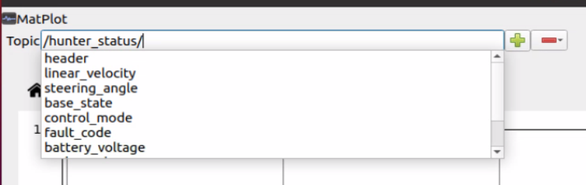
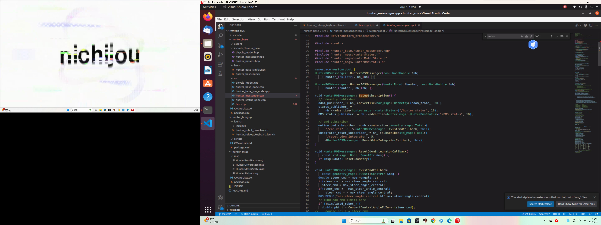

# Hunter SE

## 1 基础通讯

每次开机都要输入以下命令

```bash
# 配置 can 通讯
sudo modprobe gs_usb
sudo ip link set can0 up type can bitrate 500000
```

可以安装`can-utils`来测试硬件

```bash
sudo apt install can-utils
```

若`can-to-usb`和**HUNTER-SE**相连，且小车已经启动，则可以使用以下命令监听**HUNTER-SE**底盘数据

```
candump can0
```

输出数据示例如下

```
  can0  251   [8]  00 00 00 0F 00 00 00 54
  can0  253   [8]  00 00 00 07 00 FF FE AA
  can0  252   [8]  00 00 00 07 00 FF FB 77
  can0  221   [8]  00 00 00 00 00 00 FF FF
  can0  311   [8]  FF FF FF C1 00 00 00 12
  can0  211   [8]  00 00 01 03 00 00 00 B1
  can0  251   [8]  00 00 00 11 00 00 00 54
  can0  253   [8]  00 00 00 07 00 FF FE AA
  can0  263   [8]  01 07 00 27 D8 40 00 00
  can0  252   [8]  00 00 00 07 00 FF FB 77
  can0  221   [8]  00 00 00 00 00 00 FF FF
  can0  311   [8]  FF FF FF C1 00 00 00 12
  can0  211   [8]  00 00 01 03 00 00 00 B2
```

### 可能出现的错误

执行`candump can0`命令时，若提示如下

> cannot find device can0

**解决方法**：检查接线，若接线没有问题，则换一根线或者can-usb设备。

### 附加内容：编写开机自动运行串口命令脚本

https://blog.csdn.net/feiying0canglang/article/details/124695749

## 2 ROS配置

### 底层驱动

下载依赖

```bash
sudo apt install libasio-dev
sudo apt install ros-$ROS_DISTRO-teleop-twist-keyboard
```

克隆并编译`hunter_2_ros`源码

```bash
cd ~/catkin_ws/src
git clone --recursive https://github.com/agilexrobotics/ugv_sdk.git
git clone https://github.com/agilexrobotics/hunter_ros.git
cd ..
catkin_make
```

参考来源：https://github.com/agilexrobotics/hunter_ros

### 测试

```bash
#启动底盘
roslaunch hunter_bringup hunter_robot_base.launch

#利用键盘测试传输功能是否正常
roslaunch hunter_bringup hunter_teleop_keyboard.launch
```

**把遥控器打到上位机控制按键，再用键盘控制小车运动**。

## 3 ROS节点

```bash
/BMS_status
/cmd_vel
/hunter_status
/odom
/reset_odom_integrator
/rosout
/rosout_agg
/tf
```

* BMS_status

* cmd_vel：控制速度指令

* `hunter_status`：小车各种状态以及编码器数据(开rqt_plot)

  

  * `linear_velocity`：编码器测量的速度
  * `steering_angle`：舵机角度

* `odom`：里程计

* `reset_odom_integrator`

## 4 传感器配置

### 4.1 Realsense Camera

**注意事项**：务必安装`ros1`匹配版本.

https://github.com/IntelRealSense/realsense-ros/tree/ros1-legacy

```bash
sudo apt-get install ros-$ROS_DISTRO-realsense2-camera

mkdir -p ~/catkin_ws/src
cd ~/catkin_ws/src/

git clone https://github.com/IntelRealSense/realsense-ros.git
cd realsense-ros/
git checkout `git tag | sort -V | grep -P "^2.\d+\.\d+" | tail -1`
cd ..

catkin_init_workspace
cd ..
catkin_make clean
catkin_make -DCATKIN_ENABLE_TESTING=False -DCMAKE_BUILD_TYPE=Release
catkin_make install

echo "source ~/catkin_ws/devel/setup.bash" >> ~/.bashrc
source ~/.bashrc
```

安装的库和`launch`文件都在工作空间的`install`文件夹下。

使用方法：

```bash
roslaunch realsense2_camera rs_camera.launch
```

可以修改launch文件来调整相机配置。

#### 点云

```xml
  <arg name="enable_pointcloud"         default="true"/>
  <arg name="pointcloud_texture_stream" default="RS2_STREAM_COLOR"/>
  <arg name="pointcloud_texture_index"  default="0"/>
  <arg name="allow_no_texture_points"   default="false"/>
  <arg name="ordered_pc"                default="false"/>
```

#### 双目+imu

可以先将 rgb 和 depth 关掉

```xml
  <arg name="infra_width"         default="848"/>
  <arg name="infra_height"        default="480"/>
  <arg name="enable_infra"        default="true"/>
  <arg name="enable_infra1"       default="true"/>
  <arg name="enable_infra2"       default="true"/>
  <arg name="infra_rgb"           default="false"/>
```

有关IMU：https://blog.csdn.net/m0_60355964/article/details/125769009

```sh
  <arg name="fisheye_fps"         default="-1"/>
  <arg name="depth_fps"           default="-1"/>
  <arg name="infra_fps"           default="30"/>
  <arg name="color_fps"           default="-1"/>
  <arg name="gyro_fps"            default="-1"/>
  <arg name="accel_fps"           default="-1"/>
  <arg name="enable_gyro"         default="true"/>
  <arg name="enable_accel"        default="true"/>

  <arg name="enable_pointcloud"         default="false"/>
  <arg name="pointcloud_texture_stream" default="RS2_STREAM_COLOR"/>
  <arg name="pointcloud_texture_index"  default="0"/>
  <arg name="allow_no_texture_points"   default="false"/>
  <arg name="ordered_pc"                default="false"/>

  <arg name="enable_sync"               default="true"/>
  <arg name="align_depth"               default="false"/>
```

#### 永久关闭结构光

https://blog.csdn.net/qq_42928559/article/details/121747781

在launch文件中添加以下语句

```xml
<arg name="emitter_enable"   		   default="false"/>

<!-- rosparam set /camera/stereo_module/emitter_enabled false -->
<rosparam>
  /camera/stereo_module/emitter_enabled: 0
</rosparam>

<rosparam if="$(arg emitter_enable)">
  /camera/stereo_module/emitter_enabled: 1
</rosparam>
```

### 4.2 Livox

#### Livox_SDK

```bash
git clone https://github.com/Livox-SDK/Livox-SDK.git
cd Livox-SDK
cd build && cmake ..
make
sudo make install
```

#### livox_ros_driver

```bash
cd ~
mkdir workspace
cd workspace
git clone https://github.com/Livox-SDK/livox_ros_driver.git ws_livox/src
cd ws_livox
catkin_make
```

#### 运行

```bash
echo "source ~/workspace/ws_livox/devel/setup.bash" >> ~/.bashrc
source ~/.bashrc
roslaunch livox_ros_driver livox_lidar_rviz.launch
```

## 5 编写简单程序控制小车运动

首先找到松灵机器人给的ros包里面关于话题订阅的内容，在hunter_base/src/hunter_messenger.cpp里面


我整了一个test，在hunter_base下面test.cpp(参考https://zhuanlan.zhihu.com/p/423346179)
```bash
roslaunch hunter_bringup hunter_robot_base.launch
rosrun hunter_base test 
```


## 6 数据包采集

### 6.1 采集底盘数据

`hunter_status`话题中主要用到`linear_velocity`以及`steering_angle`数据。

```bash
#单独命令
rosbag record /hunter_status
```

### 6.2 采集相机数据

无人车采用传感器D435i相机，需要采集`IMU`、左目以及右目数据。（若有需要，可采集RGB图像）

```sh
#单独命令
rosbag record /camera/imu /camera/infra1/image_rect_raw /camera/infra2/image_rect_raw
```

### 6.3 采集Livox数据

​采集无人车的**点云数据**以及**Livox中内置的IMU数据**。

### 6.4 采集ouster机械雷达数据

### 6.5 采集GPS数据


### 6.6 采集tf信息作为已知

采集 body 坐标系与无人车其他关节的相对位姿变换。
